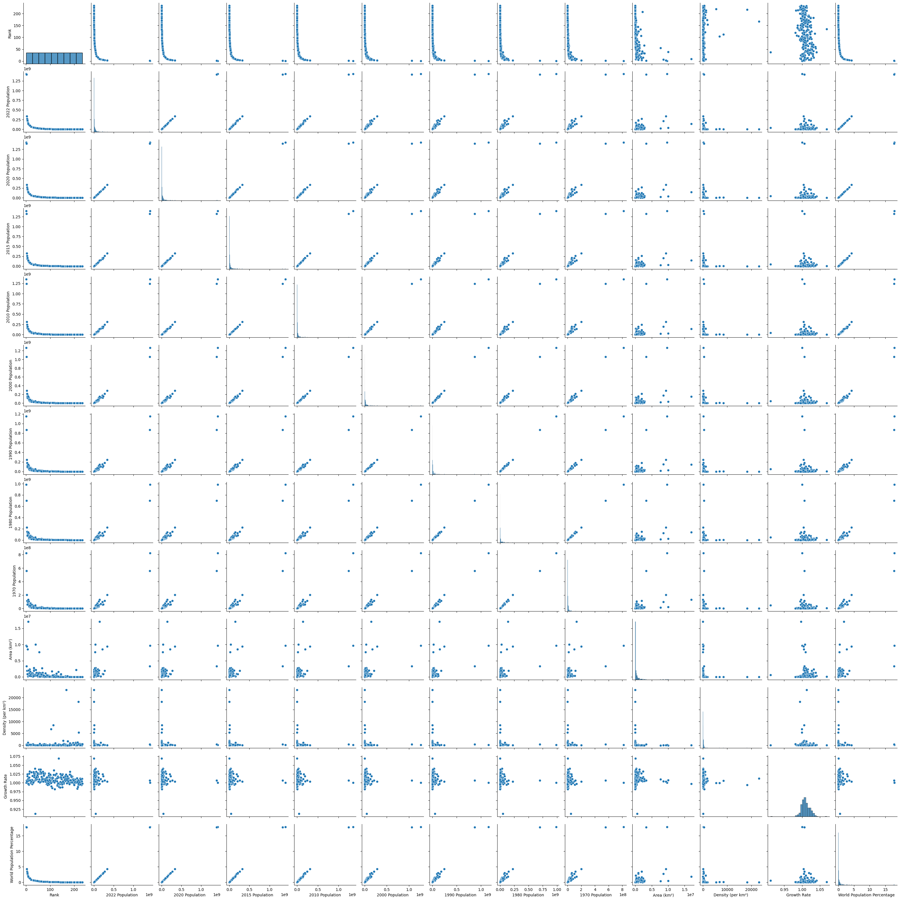
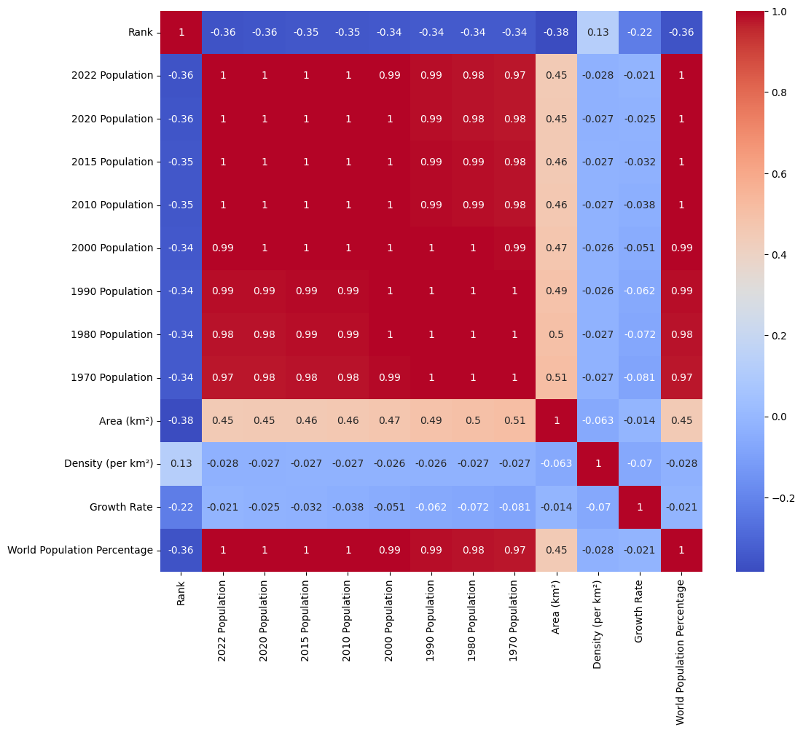
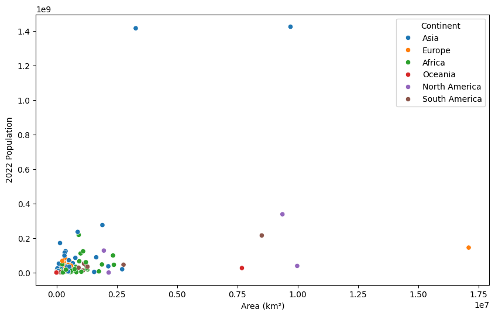
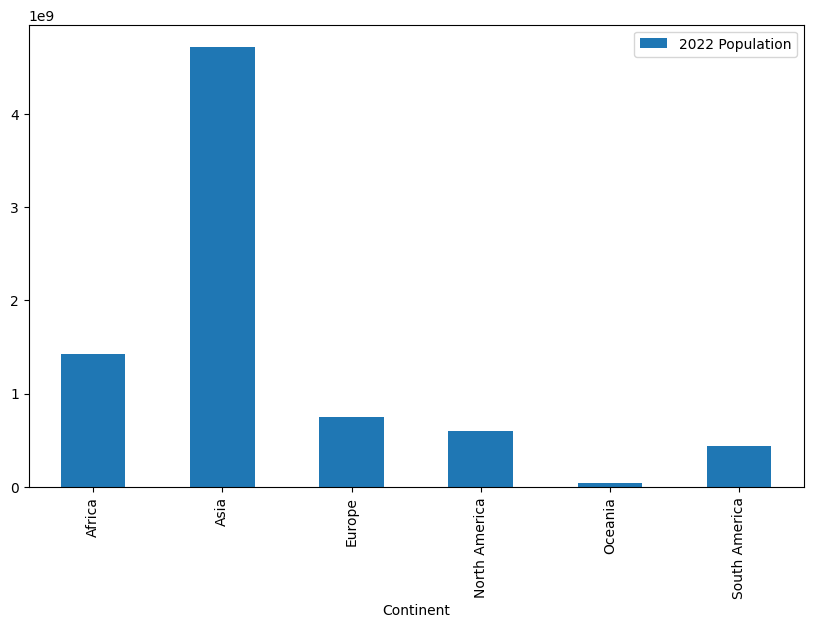
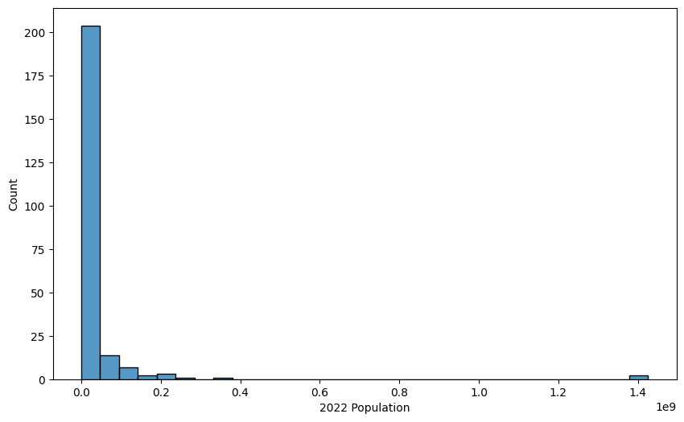
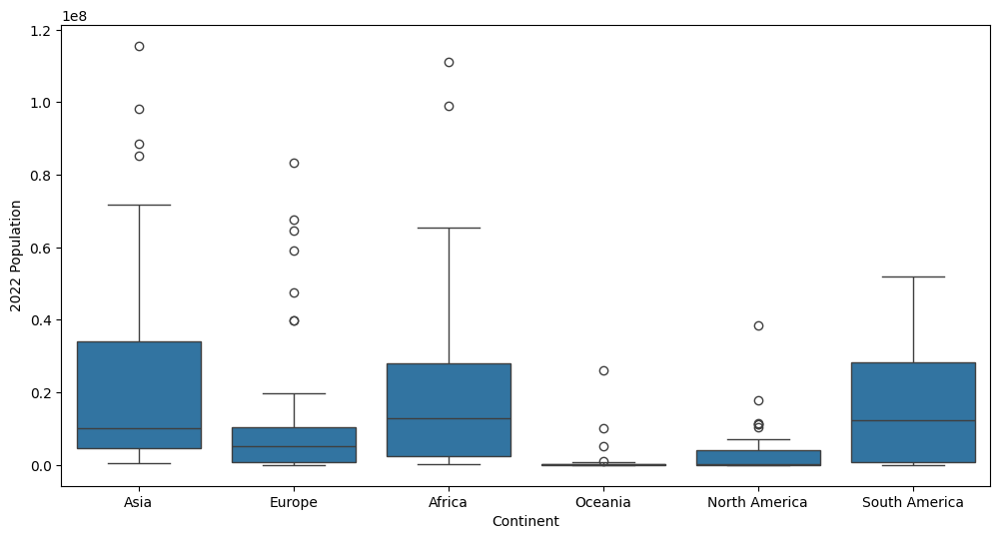
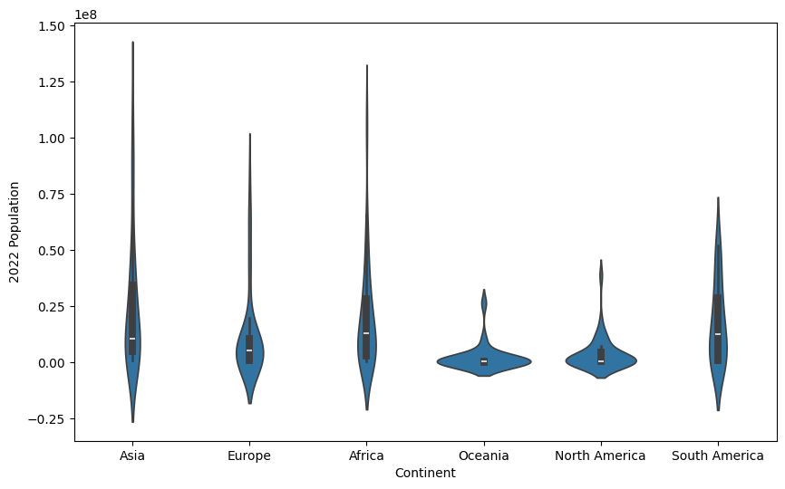

# Практическое задание № 1. Разведочный анализ данных

Ф.И.О Студента: **Мерич Дорук Каймакджыоглу**

Студ №: **1032204917**

1. Загрузить набор данных по мировому населения
[набор данных (World Population Dataset)](https://www.kaggle.com/datasets/iamsouravbanerjee/world-population-dataset?datasetId=2432740&sortBy=voteCount) как датафрейм библиотеки
pandas [ datasets_ml/world_population.csv ]
2. Получить представлении о наборе данных с помощью методов shape,
head, describe, info библиотеки pandas. Посчитать количество пустых значений
в признаках с помощью библиотеки numpy
3. Произвести разведочный анализ данных по данному набору данных –
визуализировать данные с помощью библиотек matplotlib, seaborn, plotly.

- Построить:
    1) Парные диаграммы (pairplots)
    2) Тепловую карту по матрице корреляции
    3) Диаграммы рассеяния
    4) Сводные диаграммы
    5) Гистограммы
    6) Ящик с усами (диаграмма размаха)
    7) Скрипичные диаграммы

4. На основе выполненного анализа данных произвести выводы о
динамике изменения населения по регионам, процентном соотношении
населения по регионам. Выявить корреляцию между признаками.


```python
# 1. Импортируем библиотеки и загружаем датасет:
import pandas as pd
import numpy as np
import matplotlib.pyplot as plt
import seaborn as sns
```


```python
df = pd.read_csv('datasets_ml/world_population.csv')
```

### Проверяем данные на наличие пропущенных значений и выбросов:


```python
print("Shape of the dataset:", df.shape)
print("\nFirst 5 rows:\n", df.head())
print("\nData Description:\n", df.describe())
print("\nData Information:")
df.info()
```

    Shape of the dataset: (234, 17)
    
    First 5 rows:
        Rank CCA3 Country/Territory           Capital Continent  2022 Population  \
    0    36  AFG       Afghanistan             Kabul      Asia         41128771   
    1   138  ALB           Albania            Tirana    Europe          2842321   
    2    34  DZA           Algeria           Algiers    Africa         44903225   
    3   213  ASM    American Samoa         Pago Pago   Oceania            44273   
    4   203  AND           Andorra  Andorra la Vella    Europe            79824   
    
       2020 Population  2015 Population  2010 Population  2000 Population  \
    0         38972230         33753499         28189672         19542982   
    1          2866849          2882481          2913399          3182021   
    2         43451666         39543154         35856344         30774621   
    3            46189            51368            54849            58230   
    4            77700            71746            71519            66097   
    
       1990 Population  1980 Population  1970 Population  Area (km²)  \
    0         10694796         12486631         10752971      652230   
    1          3295066          2941651          2324731       28748   
    2         25518074         18739378         13795915     2381741   
    3            47818            32886            27075         199   
    4            53569            35611            19860         468   
    
       Density (per km²)  Growth Rate  World Population Percentage  
    0            63.0587       1.0257                         0.52  
    1            98.8702       0.9957                         0.04  
    2            18.8531       1.0164                         0.56  
    3           222.4774       0.9831                         0.00  
    4           170.5641       1.0100                         0.00  
    
    Data Description:
                  Rank  2022 Population  2020 Population  2015 Population  \
    count  234.000000     2.340000e+02     2.340000e+02     2.340000e+02   
    mean   117.500000     3.407441e+07     3.350107e+07     3.172996e+07   
    std     67.694165     1.367664e+08     1.355899e+08     1.304050e+08   
    min      1.000000     5.100000e+02     5.200000e+02     5.640000e+02   
    25%     59.250000     4.197385e+05     4.152845e+05     4.046760e+05   
    50%    117.500000     5.559944e+06     5.493074e+06     5.307400e+06   
    75%    175.750000     2.247650e+07     2.144798e+07     1.973085e+07   
    max    234.000000     1.425887e+09     1.424930e+09     1.393715e+09   
    
           2010 Population  2000 Population  1990 Population  1980 Population  \
    count     2.340000e+02     2.340000e+02     2.340000e+02     2.340000e+02   
    mean      2.984524e+07     2.626947e+07     2.271022e+07     1.898462e+07   
    std       1.242185e+08     1.116982e+08     9.783217e+07     8.178519e+07   
    min       5.960000e+02     6.510000e+02     7.000000e+02     7.330000e+02   
    25%       3.931490e+05     3.272420e+05     2.641158e+05     2.296142e+05   
    50%       4.942770e+06     4.292907e+06     3.825410e+06     3.141146e+06   
    75%       1.915957e+07     1.576230e+07     1.186923e+07     9.826054e+06   
    max       1.348191e+09     1.264099e+09     1.153704e+09     9.823725e+08   
    
           1970 Population    Area (km²)  Density (per km²)  Growth Rate  \
    count     2.340000e+02  2.340000e+02         234.000000   234.000000   
    mean      1.578691e+07  5.814494e+05         452.127044     1.009577   
    std       6.779509e+07  1.761841e+06        2066.121904     0.013385   
    min       7.520000e+02  1.000000e+00           0.026100     0.912000   
    25%       1.559970e+05  2.650000e+03          38.417875     1.001775   
    50%       2.604830e+06  8.119950e+04          95.346750     1.007900   
    75%       8.817329e+06  4.304258e+05         238.933250     1.016950   
    max       8.225344e+08  1.709824e+07       23172.266700     1.069100   
    
           World Population Percentage  
    count                   234.000000  
    mean                      0.427051  
    std                       1.714977  
    min                       0.000000  
    25%                       0.010000  
    50%                       0.070000  
    75%                       0.280000  
    max                      17.880000  
    
    Data Information:
    <class 'pandas.core.frame.DataFrame'>
    RangeIndex: 234 entries, 0 to 233
    Data columns (total 17 columns):
     #   Column                       Non-Null Count  Dtype  
    ---  ------                       --------------  -----  
     0   Rank                         234 non-null    int64  
     1   CCA3                         234 non-null    object 
     2   Country/Territory            234 non-null    object 
     3   Capital                      234 non-null    object 
     4   Continent                    234 non-null    object 
     5   2022 Population              234 non-null    int64  
     6   2020 Population              234 non-null    int64  
     7   2015 Population              234 non-null    int64  
     8   2010 Population              234 non-null    int64  
     9   2000 Population              234 non-null    int64  
     10  1990 Population              234 non-null    int64  
     11  1980 Population              234 non-null    int64  
     12  1970 Population              234 non-null    int64  
     13  Area (km²)                   234 non-null    int64  
     14  Density (per km²)            234 non-null    float64
     15  Growth Rate                  234 non-null    float64
     16  World Population Percentage  234 non-null    float64
    dtypes: float64(3), int64(10), object(4)
    memory usage: 31.2+ KB
    


```python
null_counts = df.isnull().sum() # или print(df.isnull().sum())
print("\nNumber of null values in each column:\n", null_counts)
```

    
    Number of null values in each column:
     Rank                           0
    CCA3                           0
    Country/Territory              0
    Capital                        0
    Continent                      0
    2022 Population                0
    2020 Population                0
    2015 Population                0
    2010 Population                0
    2000 Population                0
    1990 Population                0
    1980 Population                0
    1970 Population                0
    Area (km²)                     0
    Density (per km²)              0
    Growth Rate                    0
    World Population Percentage    0
    dtype: int64
    

### Построим:

1) Парные диаграммы:


```python
pairplot = sns.pairplot(df)
```


    

    


2) Тепловая карта по матрице корреляции


```python
plt.figure(figsize=(12, 10))
numeric_data = df.select_dtypes(include=[np.number])
correlation_heatmap = sns.heatmap(numeric_data.corr(), annot=True, cmap='coolwarm')
selected_columns = ['Continent', '2022 Population', 'Area (km²)', 'Density (per km²)', 'Growth Rate']
visualization_data = df[selected_columns]
```


    

    


3) Диаграммы рассеяния


```python
plt.figure(figsize=(10, 6))
scatter_plot = sns.scatterplot(x='Area (km²)', y='2022 Population', data=visualization_data, hue='Continent')
```


    

    


4) Сводные диаграммы


```python
pivot_table = visualization_data.pivot_table(index='Continent', values='2022 Population', aggfunc='sum')
pivot_table.plot(kind='bar', figsize=(10, 6))
```


    <Axes: xlabel='Continent'>


    

    


5) Гистограммы


```python
plt.figure(figsize=(10, 6))
histogram = sns.histplot(df['2022 Population'], bins=30)
```


    

    


6) Ящик с усами (диаграмма размаха)


```python
plt.figure(figsize=(12, 6))
population_limit = visualization_data['2022 Population'].quantile(0.95)
boxplot = sns.boxplot(x='Continent', y='2022 Population', data=visualization_data[visualization_data['2022 Population'] < population_limit])
```


    

    


7) Скрипичные диаграммы


```python
plt.figure(figsize=(10, 6))
violin_plot = sns.violinplot(x='Continent', y='2022 Population', data=visualization_data[visualization_data['2022 Population'] < population_limit])
```


    

    


```python

```
