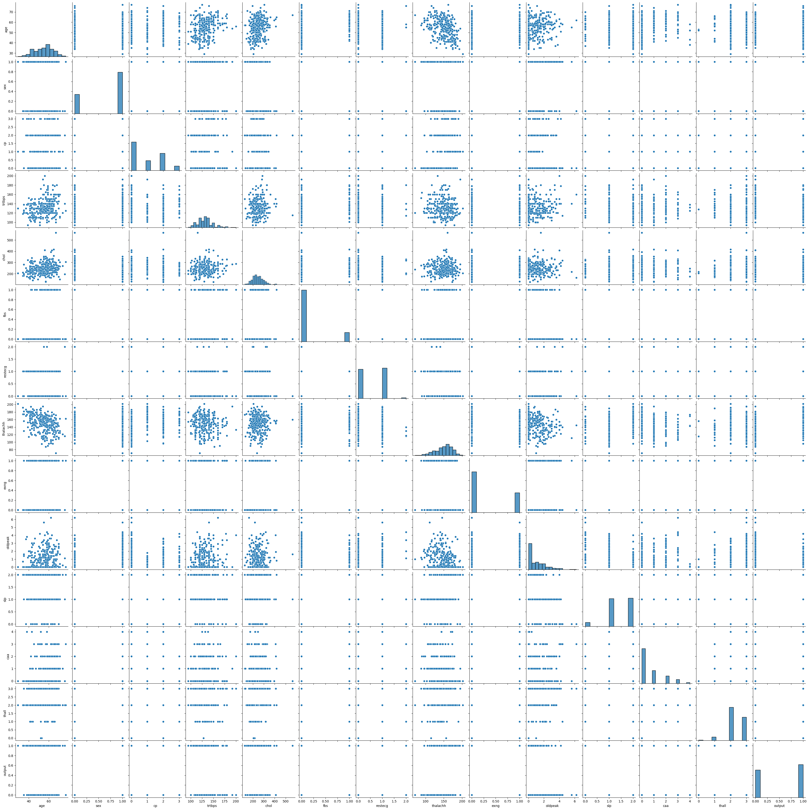
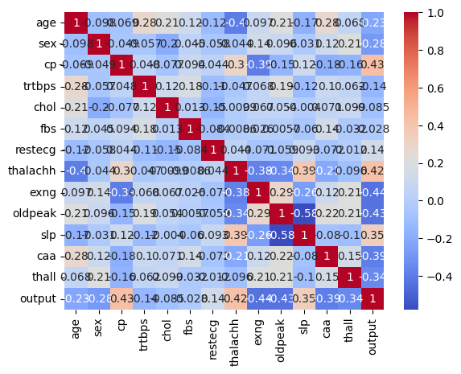
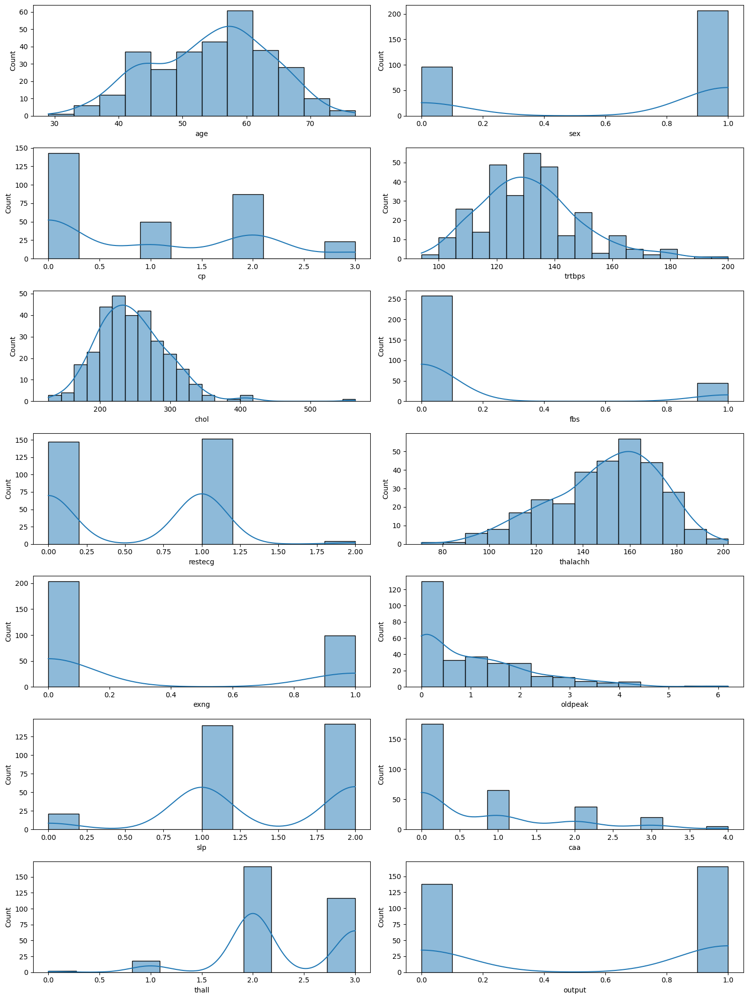
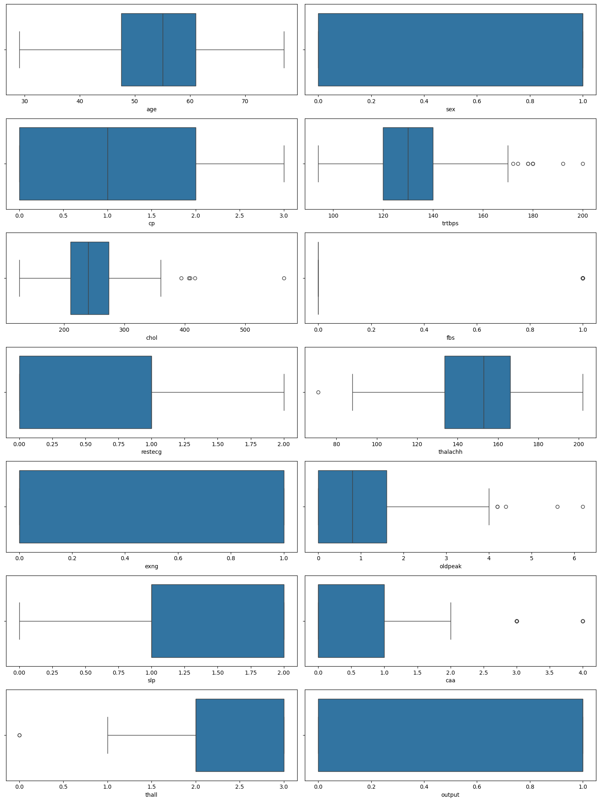
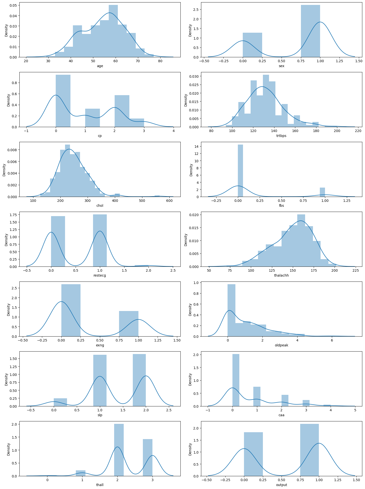

## Практическое задание № 2. Задача бинарной классификации сбалансированного набора данных

Ф.И.О Студента: **Мерич Дорук Каймакджыоглу**

Студ №: **1032204917**

1. Загрузить набор данных по анализу и прогнозированию вероятности
инфаркта [набор данных (Heart Attack Analysis & Prediction Dataset)](https://www.kaggle.com/datasets/rashikrahmanpritom/heart-attack-analysis-prediction-dataset?datasetId=1226038&sortBy=voteCount) как датафрейм библиотеки pandas.
2. Получить представлении о наборе данных с помощью методов shape, head, describe, info библиотеки pandas. Посчитать количество пустых значений в признаках с помощью библиотеки numpy.
3. Произвести разведочный анализ данных по данному набору данных –
визуализировать данные с помощью библиотек matplotlib, seaborn, plotly.
- Построить:
    1) Парные диаграммы
    2) Тепловую карту по матрице корреляции
    3) Гистограммы
    4) Ящик с усами (диаграмма размаха)
    5) Графики распределения
4. На основе выполненного анализа данных произвести выводы о влиянии различных признаков на вероятность инфаркта
5. Произвести предобработку данных – удалить из набора данных признаки, слабо коррелирующие между собой и с вероятностью инфаркта. Закодировать категориальные признаки в дискретные величины с помощью метода get_dummies, используя библиотеку sklearn. Произвести нормализацию данных с помощью метода RobustScaler библиотеки sklearn. Разбить обработанный набор данных на обучающую и тестовую выборки с помощью метода train_test_split библиотеки sklearn.
6. Произвести обучение следующих моделей библиотеки sklearn:
    1) Метод опорных векторов (Support vector machine)
    2) Логистическая регрессия (LogisticRegression)
    3) Дерево решений (Decision Tree)
    4) Случайный лес (RandomForest)
7. Отобразить корректность работы каждой модели на тестовой и обучающей выборках с помощью метрики accuracy библиотеки sklearn.


```python
import pandas as pd
import numpy as np
import matplotlib.pyplot as plt
import seaborn as sns
import plotly.express as px

heart = pd.read_csv('datasets_ml/heart.csv')
o2 = pd.read_csv('datasets_ml/o2Saturation.csv')

print("---- Heart Data ----")
print("Shape of the dataset:", heart.shape)
print("\nFirst 5 rows:\n", heart.head())
print("\nData Description:\n", heart.describe())
print("\nData Information:")
heart.info()

print("---- O2 Data ----")
print("Shape of the dataset:", o2.shape)
print("\nFirst 5 rows:\n", o2.head())
print("\nData Description:\n", o2.describe())
print("\nData Information:")
o2.info()
```

    ---- Heart Data ----
    Shape of the dataset: (303, 14)
    
    First 5 rows:
        age  sex  cp  trtbps  chol  fbs  restecg  thalachh  exng  oldpeak  slp  \
    0   63    1   3     145   233    1        0       150     0      2.3    0   
    1   37    1   2     130   250    0        1       187     0      3.5    0   
    2   41    0   1     130   204    0        0       172     0      1.4    2   
    3   56    1   1     120   236    0        1       178     0      0.8    2   
    4   57    0   0     120   354    0        1       163     1      0.6    2   
    
       caa  thall  output  
    0    0      1       1  
    1    0      2       1  
    2    0      2       1  
    3    0      2       1  
    4    0      2       1  
    
    Data Description:
                   age         sex          cp      trtbps        chol         fbs  \
    count  303.000000  303.000000  303.000000  303.000000  303.000000  303.000000   
    mean    54.366337    0.683168    0.966997  131.623762  246.264026    0.148515   
    std      9.082101    0.466011    1.032052   17.538143   51.830751    0.356198   
    min     29.000000    0.000000    0.000000   94.000000  126.000000    0.000000   
    25%     47.500000    0.000000    0.000000  120.000000  211.000000    0.000000   
    50%     55.000000    1.000000    1.000000  130.000000  240.000000    0.000000   
    75%     61.000000    1.000000    2.000000  140.000000  274.500000    0.000000   
    max     77.000000    1.000000    3.000000  200.000000  564.000000    1.000000   
    
              restecg    thalachh        exng     oldpeak         slp         caa  \
    count  303.000000  303.000000  303.000000  303.000000  303.000000  303.000000   
    mean     0.528053  149.646865    0.326733    1.039604    1.399340    0.729373   
    std      0.525860   22.905161    0.469794    1.161075    0.616226    1.022606   
    min      0.000000   71.000000    0.000000    0.000000    0.000000    0.000000   
    25%      0.000000  133.500000    0.000000    0.000000    1.000000    0.000000   
    50%      1.000000  153.000000    0.000000    0.800000    1.000000    0.000000   
    75%      1.000000  166.000000    1.000000    1.600000    2.000000    1.000000   
    max      2.000000  202.000000    1.000000    6.200000    2.000000    4.000000   
    
                thall      output  
    count  303.000000  303.000000  
    mean     2.313531    0.544554  
    std      0.612277    0.498835  
    min      0.000000    0.000000  
    25%      2.000000    0.000000  
    50%      2.000000    1.000000  
    75%      3.000000    1.000000  
    max      3.000000    1.000000  
    
    Data Information:
    <class 'pandas.core.frame.DataFrame'>
    RangeIndex: 303 entries, 0 to 302
    Data columns (total 14 columns):
     #   Column    Non-Null Count  Dtype  
    ---  ------    --------------  -----  
     0   age       303 non-null    int64  
     1   sex       303 non-null    int64  
     2   cp        303 non-null    int64  
     3   trtbps    303 non-null    int64  
     4   chol      303 non-null    int64  
     5   fbs       303 non-null    int64  
     6   restecg   303 non-null    int64  
     7   thalachh  303 non-null    int64  
     8   exng      303 non-null    int64  
     9   oldpeak   303 non-null    float64
     10  slp       303 non-null    int64  
     11  caa       303 non-null    int64  
     12  thall     303 non-null    int64  
     13  output    303 non-null    int64  
    dtypes: float64(1), int64(13)
    memory usage: 33.3 KB
    ---- O2 Data ----
    Shape of the dataset: (3585, 1)
    
    First 5 rows:
        98.6
    0  98.6
    1  98.6
    2  98.6
    3  98.1
    4  97.5
    
    Data Description:
                   98.6
    count  3585.000000
    mean     98.239275
    std       0.726336
    min      96.500000
    25%      97.600000
    50%      98.600000
    75%      98.600000
    max      99.600000
    
    Data Information:
    <class 'pandas.core.frame.DataFrame'>
    RangeIndex: 3585 entries, 0 to 3584
    Data columns (total 1 columns):
     #   Column  Non-Null Count  Dtype  
    ---  ------  --------------  -----  
     0   98.6    3585 non-null   float64
    dtypes: float64(1)
    memory usage: 28.1 KB
    


```python
heart_missing_values = heart.isnull().sum()
o2_missing_values = o2.isnull().sum()
print(heart_missing_values)
print(o2_missing_values)
```

    age         0
    sex         0
    cp          0
    trtbps      0
    chol        0
    fbs         0
    restecg     0
    thalachh    0
    exng        0
    oldpeak     0
    slp         0
    caa         0
    thall       0
    output      0
    dtype: int64
    98.6    0
    dtype: int64
    

#### *Парные диаграммы*


```python
pair_plot = sns.pairplot(heart)
```


    

    


#### *Тепловую карту по матрице корреляции*


```python
correlation_matrix = heart.corr()
heatmap = sns.heatmap(correlation_matrix, annot=True, cmap='coolwarm')
```


    

    


#### *Гистограммы*


```python
fig, axes = plt.subplots(nrows=7, ncols=2, figsize=(15, 20))
axes = axes.flatten()
for i, column in enumerate(heart.columns):
    sns.histplot(heart[column], ax=axes[i], kde=True)
plt.tight_layout()
```


    

    


#### *Ящик с усами (диаграмма размаха)*


```python
fig, axes = plt.subplots(nrows=7, ncols=2, figsize=(15, 20))
axes = axes.flatten()
for i, column in enumerate(heart.select_dtypes(include=['float64', 'int64']).columns):
    sns.boxplot(x=heart[column], ax=axes[i])
plt.tight_layout()
```


    

    


#### *Графики распределения*


```python
fig, axes = plt.subplots(nrows=7, ncols=2, figsize=(15, 20))
axes = axes.flatten()
for i, column in enumerate(heart.select_dtypes(include=['float64', 'int64']).columns):
    sns.distplot(heart[column], ax=axes[i])
plt.tight_layout()
```

    C:\Users\Meric\AppData\Local\Temp\ipykernel_2664\1518406898.py:4: UserWarning: 
    
    `distplot` is a deprecated function and will be removed in seaborn v0.14.0.
    
    Please adapt your code to use either `displot` (a figure-level function with
    similar flexibility) or `histplot` (an axes-level function for histograms).
    
    For a guide to updating your code to use the new functions, please see
    https://gist.github.com/mwaskom/de44147ed2974457ad6372750bbe5751
    
      sns.distplot(heart[column], ax=axes[i])
    C:\Users\Meric\AppData\Local\Temp\ipykernel_2664\1518406898.py:4: UserWarning: 
    
    `distplot` is a deprecated function and will be removed in seaborn v0.14.0.
    
    Please adapt your code to use either `displot` (a figure-level function with
    similar flexibility) or `histplot` (an axes-level function for histograms).
    
    For a guide to updating your code to use the new functions, please see
    https://gist.github.com/mwaskom/de44147ed2974457ad6372750bbe5751
    
      sns.distplot(heart[column], ax=axes[i])
    C:\Users\Meric\AppData\Local\Temp\ipykernel_2664\1518406898.py:4: UserWarning: 
    
    `distplot` is a deprecated function and will be removed in seaborn v0.14.0.
    
    Please adapt your code to use either `displot` (a figure-level function with
    similar flexibility) or `histplot` (an axes-level function for histograms).
    
    For a guide to updating your code to use the new functions, please see
    https://gist.github.com/mwaskom/de44147ed2974457ad6372750bbe5751
    
      sns.distplot(heart[column], ax=axes[i])
    C:\Users\Meric\AppData\Local\Temp\ipykernel_2664\1518406898.py:4: UserWarning: 
    
    `distplot` is a deprecated function and will be removed in seaborn v0.14.0.
    
    Please adapt your code to use either `displot` (a figure-level function with
    similar flexibility) or `histplot` (an axes-level function for histograms).
    
    For a guide to updating your code to use the new functions, please see
    https://gist.github.com/mwaskom/de44147ed2974457ad6372750bbe5751
    
      sns.distplot(heart[column], ax=axes[i])
    C:\Users\Meric\AppData\Local\Temp\ipykernel_2664\1518406898.py:4: UserWarning: 
    
    `distplot` is a deprecated function and will be removed in seaborn v0.14.0.
    
    Please adapt your code to use either `displot` (a figure-level function with
    similar flexibility) or `histplot` (an axes-level function for histograms).
    
    For a guide to updating your code to use the new functions, please see
    https://gist.github.com/mwaskom/de44147ed2974457ad6372750bbe5751
    
      sns.distplot(heart[column], ax=axes[i])
    C:\Users\Meric\AppData\Local\Temp\ipykernel_2664\1518406898.py:4: UserWarning: 
    
    `distplot` is a deprecated function and will be removed in seaborn v0.14.0.
    
    Please adapt your code to use either `displot` (a figure-level function with
    similar flexibility) or `histplot` (an axes-level function for histograms).
    
    For a guide to updating your code to use the new functions, please see
    https://gist.github.com/mwaskom/de44147ed2974457ad6372750bbe5751
    
      sns.distplot(heart[column], ax=axes[i])
    C:\Users\Meric\AppData\Local\Temp\ipykernel_2664\1518406898.py:4: UserWarning: 
    
    `distplot` is a deprecated function and will be removed in seaborn v0.14.0.
    
    Please adapt your code to use either `displot` (a figure-level function with
    similar flexibility) or `histplot` (an axes-level function for histograms).
    
    For a guide to updating your code to use the new functions, please see
    https://gist.github.com/mwaskom/de44147ed2974457ad6372750bbe5751
    
      sns.distplot(heart[column], ax=axes[i])
    C:\Users\Meric\AppData\Local\Temp\ipykernel_2664\1518406898.py:4: UserWarning: 
    
    `distplot` is a deprecated function and will be removed in seaborn v0.14.0.
    
    Please adapt your code to use either `displot` (a figure-level function with
    similar flexibility) or `histplot` (an axes-level function for histograms).
    
    For a guide to updating your code to use the new functions, please see
    https://gist.github.com/mwaskom/de44147ed2974457ad6372750bbe5751
    
      sns.distplot(heart[column], ax=axes[i])
    C:\Users\Meric\AppData\Local\Temp\ipykernel_2664\1518406898.py:4: UserWarning: 
    
    `distplot` is a deprecated function and will be removed in seaborn v0.14.0.
    
    Please adapt your code to use either `displot` (a figure-level function with
    similar flexibility) or `histplot` (an axes-level function for histograms).
    
    For a guide to updating your code to use the new functions, please see
    https://gist.github.com/mwaskom/de44147ed2974457ad6372750bbe5751
    
      sns.distplot(heart[column], ax=axes[i])
    C:\Users\Meric\AppData\Local\Temp\ipykernel_2664\1518406898.py:4: UserWarning: 
    
    `distplot` is a deprecated function and will be removed in seaborn v0.14.0.
    
    Please adapt your code to use either `displot` (a figure-level function with
    similar flexibility) or `histplot` (an axes-level function for histograms).
    
    For a guide to updating your code to use the new functions, please see
    https://gist.github.com/mwaskom/de44147ed2974457ad6372750bbe5751
    
      sns.distplot(heart[column], ax=axes[i])
    C:\Users\Meric\AppData\Local\Temp\ipykernel_2664\1518406898.py:4: UserWarning: 
    
    `distplot` is a deprecated function and will be removed in seaborn v0.14.0.
    
    Please adapt your code to use either `displot` (a figure-level function with
    similar flexibility) or `histplot` (an axes-level function for histograms).
    
    For a guide to updating your code to use the new functions, please see
    https://gist.github.com/mwaskom/de44147ed2974457ad6372750bbe5751
    
      sns.distplot(heart[column], ax=axes[i])
    C:\Users\Meric\AppData\Local\Temp\ipykernel_2664\1518406898.py:4: UserWarning: 
    
    `distplot` is a deprecated function and will be removed in seaborn v0.14.0.
    
    Please adapt your code to use either `displot` (a figure-level function with
    similar flexibility) or `histplot` (an axes-level function for histograms).
    
    For a guide to updating your code to use the new functions, please see
    https://gist.github.com/mwaskom/de44147ed2974457ad6372750bbe5751
    
      sns.distplot(heart[column], ax=axes[i])
    C:\Users\Meric\AppData\Local\Temp\ipykernel_2664\1518406898.py:4: UserWarning: 
    
    `distplot` is a deprecated function and will be removed in seaborn v0.14.0.
    
    Please adapt your code to use either `displot` (a figure-level function with
    similar flexibility) or `histplot` (an axes-level function for histograms).
    
    For a guide to updating your code to use the new functions, please see
    https://gist.github.com/mwaskom/de44147ed2974457ad6372750bbe5751
    
      sns.distplot(heart[column], ax=axes[i])
    C:\Users\Meric\AppData\Local\Temp\ipykernel_2664\1518406898.py:4: UserWarning: 
    
    `distplot` is a deprecated function and will be removed in seaborn v0.14.0.
    
    Please adapt your code to use either `displot` (a figure-level function with
    similar flexibility) or `histplot` (an axes-level function for histograms).
    
    For a guide to updating your code to use the new functions, please see
    https://gist.github.com/mwaskom/de44147ed2974457ad6372750bbe5751
    
      sns.distplot(heart[column], ax=axes[i])
    


    

    


```python
from sklearn.model_selection import train_test_split
from sklearn.preprocessing import RobustScaler

correlation_matrix = heart.corr()

correlation_threshold = 0.2
strong_correlations = correlation_matrix[abs(correlation_matrix['output']) > correlation_threshold]['output']
features_to_keep = strong_correlations.index.tolist()
processed_heart_data = heart[features_to_keep]

categorical_features = ['sex', 'cp', 'fbs', 'restecg', 'exng', 'slp', 'caa', 'thall']

updated_categorical_features = [feature for feature in categorical_features if feature in processed_heart_data.columns]
processed_heart_data = pd.get_dummies(processed_heart_data, columns=updated_categorical_features, drop_first=True)

scaler = RobustScaler()
scaled_features = scaler.fit_transform(processed_heart_data.drop('output', axis=1))
scaled_heart_data = pd.DataFrame(scaled_features, columns=processed_heart_data.drop('output', axis=1).columns)
scaled_heart_data['output'] = processed_heart_data['output']

X = scaled_heart_data.drop('output', axis=1)
y = scaled_heart_data['output']

X_train, X_test, y_train, y_test = train_test_split(X, y, test_size=0.2, random_state=42)
```


```python
from sklearn.svm import SVC
from sklearn.linear_model import LogisticRegression
from sklearn.tree import DecisionTreeClassifier
from sklearn.ensemble import RandomForestClassifier
from sklearn.metrics import accuracy_score
```

#### *Метод опорных векторов (Support vector machine)*


```python
svm_model = SVC()

svm_model.fit(X_train, y_train)
svm_predictions_train = svm_model.predict(X_train)
svm_predictions_test = svm_model.predict(X_test)
svm_accuracy_train = accuracy_score(y_train, svm_predictions_train)
svm_accuracy_test = accuracy_score(y_test, svm_predictions_test)

print(svm_accuracy_train)
svm_accuracy_test
```

    0.9049586776859504
    


    0.8524590163934426


#### *Логистическая регрессия (LogisticRegression)*


```python
log_reg_model = LogisticRegression()

log_reg_model.fit(X_train, y_train)
log_reg_predictions_train = log_reg_model.predict(X_train)
log_reg_predictions_test = log_reg_model.predict(X_test)
log_reg_accuracy_train = accuracy_score(y_train, log_reg_predictions_train)
log_reg_accuracy_test = accuracy_score(y_test, log_reg_predictions_test)

print(log_reg_accuracy_train)
log_reg_accuracy_test
```

    0.859504132231405
    


    0.9016393442622951


#### *Дерево решений (Decision Tree)*


```python
decision_tree_model = DecisionTreeClassifier()

decision_tree_model.fit(X_train, y_train)
dt_predictions_train = decision_tree_model.predict(X_train)
dt_predictions_test = decision_tree_model.predict(X_test)
dt_accuracy_train = accuracy_score(y_train, dt_predictions_train)
dt_accuracy_test = accuracy_score(y_test, dt_predictions_test)

print(dt_accuracy_train)
dt_accuracy_test
```

    1.0
    


    0.6557377049180327


#### *Случайный лес (RandomForest)*


```python
random_forest_model = RandomForestClassifier()

random_forest_model.fit(X_train, y_train)
rf_predictions_train = random_forest_model.predict(X_train)
rf_predictions_test = random_forest_model.predict(X_test)
rf_accuracy_train = accuracy_score(y_train, rf_predictions_train)
rf_accuracy_test = accuracy_score(y_test, rf_predictions_test)

print(rf_accuracy_train)
rf_accuracy_test
```

    1.0
    


    0.8360655737704918


```python
model_accuracies = {
    "Model": ["SVM", "Logistic Regression", "Decision Tree", "Random Forest"],
    "Training Accuracy": [svm_accuracy_train, log_reg_accuracy_train, dt_accuracy_train, rf_accuracy_train],
    "Test Accuracy": [svm_accuracy_test, log_reg_accuracy_test, dt_accuracy_test, rf_accuracy_test]
}
accuracy_summary = pd.DataFrame(model_accuracies)
accuracy_summary
```


<div>
<style scoped>
    .dataframe tbody tr th:only-of-type {
        vertical-align: middle;
    }

    .dataframe tbody tr th {
        vertical-align: top;
    }

    .dataframe thead th {
        text-align: right;
    }
</style>
<table border="1" class="dataframe">
  <thead>
    <tr style="text-align: right;">
      <th></th>
      <th>Model</th>
      <th>Training Accuracy</th>
      <th>Test Accuracy</th>
    </tr>
  </thead>
  <tbody>
    <tr>
      <th>0</th>
      <td>SVM</td>
      <td>0.904959</td>
      <td>0.852459</td>
    </tr>
    <tr>
      <th>1</th>
      <td>Logistic Regression</td>
      <td>0.859504</td>
      <td>0.901639</td>
    </tr>
    <tr>
      <th>2</th>
      <td>Decision Tree</td>
      <td>1.000000</td>
      <td>0.655738</td>
    </tr>
    <tr>
      <th>3</th>
      <td>Random Forest</td>
      <td>1.000000</td>
      <td>0.836066</td>
    </tr>
  </tbody>
</table>
</div>


```python

```
