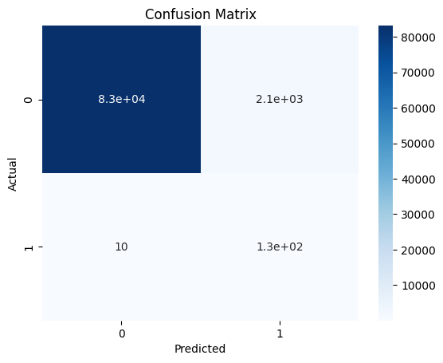

## Практическое задание № 4. Задача классификации несбалансированного набора данных

Ф.И.О Студента: **Мерич Дорук Каймакджыоглу**

Студ №: **1032204917**

1. Загрузить набор данных по обнаружению мошенничества с кредитными картами [набор данных (credit card)](https://www.kaggle.com/datasets/mlg-ulb/creditcardfraud) как датафрейм библиотеки pandas
2. Получить представлении о наборе данных с помощью методов shape, head, describe, info библиотеки pandas. Посчитать количество пустых значений в признаках с помощью библиотеки numpy
3. На основе выполненного анализа данных произвести выводы о структуре набора данных
4. Произвести скалярную стандартизацию данных. Разбить обработанный набор данных на обучающую и тестовую выборки с помощью метода train_test_split библиотеки sklearn
5. Произвести обучение следующих моделей библиотеки sklearn:
    1) Логистическая регрессия (Logistic Regression)
6. Отобразить точность работы каждой модели на тестовой и обучающей выборках с помощью метрик precision, recall, f1-score и ROC-кривой библиотеки sklearn
7. Повторно отобразить метрики после проведения кросс-валидации.


```python
import pandas as pd
import numpy as np
from sklearn.model_selection import train_test_split, cross_val_score
from sklearn.preprocessing import StandardScaler
from sklearn.linear_model import LogisticRegression
from sklearn.metrics import classification_report, roc_curve, auc, confusion_matrix, accuracy_score
import seaborn as sns
import matplotlib.pyplot as plt

creditcard = pd.read_csv('datasets_ml/creditcard.csv')

print("---- Creditcard Data ----")
print("Shape of the dataset:", creditcard.shape)
print("\nFirst 5 rows:\n", creditcard.head())
print("\nData Description:\n", creditcard.describe())
print("\nData Information:")
creditcard.info()
```

    ---- Creditcard Data ----
    Shape of the dataset: (284807, 31)
    
    First 5 rows:
        Time        V1        V2        V3        V4        V5        V6        V7  \
    0   0.0 -1.359807 -0.072781  2.536347  1.378155 -0.338321  0.462388  0.239599   
    1   0.0  1.191857  0.266151  0.166480  0.448154  0.060018 -0.082361 -0.078803   
    2   1.0 -1.358354 -1.340163  1.773209  0.379780 -0.503198  1.800499  0.791461   
    3   1.0 -0.966272 -0.185226  1.792993 -0.863291 -0.010309  1.247203  0.237609   
    4   2.0 -1.158233  0.877737  1.548718  0.403034 -0.407193  0.095921  0.592941   
    
             V8        V9  ...       V21       V22       V23       V24       V25  \
    0  0.098698  0.363787  ... -0.018307  0.277838 -0.110474  0.066928  0.128539   
    1  0.085102 -0.255425  ... -0.225775 -0.638672  0.101288 -0.339846  0.167170   
    2  0.247676 -1.514654  ...  0.247998  0.771679  0.909412 -0.689281 -0.327642   
    3  0.377436 -1.387024  ... -0.108300  0.005274 -0.190321 -1.175575  0.647376   
    4 -0.270533  0.817739  ... -0.009431  0.798278 -0.137458  0.141267 -0.206010   
    
            V26       V27       V28  Amount  Class  
    0 -0.189115  0.133558 -0.021053  149.62      0  
    1  0.125895 -0.008983  0.014724    2.69      0  
    2 -0.139097 -0.055353 -0.059752  378.66      0  
    3 -0.221929  0.062723  0.061458  123.50      0  
    4  0.502292  0.219422  0.215153   69.99      0  
    
    [5 rows x 31 columns]
    
    Data Description:
                     Time            V1            V2            V3            V4  \
    count  284807.000000  2.848070e+05  2.848070e+05  2.848070e+05  2.848070e+05   
    mean    94813.859575  1.168375e-15  3.416908e-16 -1.379537e-15  2.074095e-15   
    std     47488.145955  1.958696e+00  1.651309e+00  1.516255e+00  1.415869e+00   
    min         0.000000 -5.640751e+01 -7.271573e+01 -4.832559e+01 -5.683171e+00   
    25%     54201.500000 -9.203734e-01 -5.985499e-01 -8.903648e-01 -8.486401e-01   
    50%     84692.000000  1.810880e-02  6.548556e-02  1.798463e-01 -1.984653e-02   
    75%    139320.500000  1.315642e+00  8.037239e-01  1.027196e+00  7.433413e-01   
    max    172792.000000  2.454930e+00  2.205773e+01  9.382558e+00  1.687534e+01   
    
                     V5            V6            V7            V8            V9  \
    count  2.848070e+05  2.848070e+05  2.848070e+05  2.848070e+05  2.848070e+05   
    mean   9.604066e-16  1.487313e-15 -5.556467e-16  1.213481e-16 -2.406331e-15   
    std    1.380247e+00  1.332271e+00  1.237094e+00  1.194353e+00  1.098632e+00   
    min   -1.137433e+02 -2.616051e+01 -4.355724e+01 -7.321672e+01 -1.343407e+01   
    25%   -6.915971e-01 -7.682956e-01 -5.540759e-01 -2.086297e-01 -6.430976e-01   
    50%   -5.433583e-02 -2.741871e-01  4.010308e-02  2.235804e-02 -5.142873e-02   
    75%    6.119264e-01  3.985649e-01  5.704361e-01  3.273459e-01  5.971390e-01   
    max    3.480167e+01  7.330163e+01  1.205895e+02  2.000721e+01  1.559499e+01   
    
           ...           V21           V22           V23           V24  \
    count  ...  2.848070e+05  2.848070e+05  2.848070e+05  2.848070e+05   
    mean   ...  1.654067e-16 -3.568593e-16  2.578648e-16  4.473266e-15   
    std    ...  7.345240e-01  7.257016e-01  6.244603e-01  6.056471e-01   
    min    ... -3.483038e+01 -1.093314e+01 -4.480774e+01 -2.836627e+00   
    25%    ... -2.283949e-01 -5.423504e-01 -1.618463e-01 -3.545861e-01   
    50%    ... -2.945017e-02  6.781943e-03 -1.119293e-02  4.097606e-02   
    75%    ...  1.863772e-01  5.285536e-01  1.476421e-01  4.395266e-01   
    max    ...  2.720284e+01  1.050309e+01  2.252841e+01  4.584549e+00   
    
                    V25           V26           V27           V28         Amount  \
    count  2.848070e+05  2.848070e+05  2.848070e+05  2.848070e+05  284807.000000   
    mean   5.340915e-16  1.683437e-15 -3.660091e-16 -1.227390e-16      88.349619   
    std    5.212781e-01  4.822270e-01  4.036325e-01  3.300833e-01     250.120109   
    min   -1.029540e+01 -2.604551e+00 -2.256568e+01 -1.543008e+01       0.000000   
    25%   -3.171451e-01 -3.269839e-01 -7.083953e-02 -5.295979e-02       5.600000   
    50%    1.659350e-02 -5.213911e-02  1.342146e-03  1.124383e-02      22.000000   
    75%    3.507156e-01  2.409522e-01  9.104512e-02  7.827995e-02      77.165000   
    max    7.519589e+00  3.517346e+00  3.161220e+01  3.384781e+01   25691.160000   
    
                   Class  
    count  284807.000000  
    mean        0.001727  
    std         0.041527  
    min         0.000000  
    25%         0.000000  
    50%         0.000000  
    75%         0.000000  
    max         1.000000  
    
    [8 rows x 31 columns]
    
    Data Information:
    <class 'pandas.core.frame.DataFrame'>
    RangeIndex: 284807 entries, 0 to 284806
    Data columns (total 31 columns):
     #   Column  Non-Null Count   Dtype  
    ---  ------  --------------   -----  
     0   Time    284807 non-null  float64
     1   V1      284807 non-null  float64
     2   V2      284807 non-null  float64
     3   V3      284807 non-null  float64
     4   V4      284807 non-null  float64
     5   V5      284807 non-null  float64
     6   V6      284807 non-null  float64
     7   V7      284807 non-null  float64
     8   V8      284807 non-null  float64
     9   V9      284807 non-null  float64
     10  V10     284807 non-null  float64
     11  V11     284807 non-null  float64
     12  V12     284807 non-null  float64
     13  V13     284807 non-null  float64
     14  V14     284807 non-null  float64
     15  V15     284807 non-null  float64
     16  V16     284807 non-null  float64
     17  V17     284807 non-null  float64
     18  V18     284807 non-null  float64
     19  V19     284807 non-null  float64
     20  V20     284807 non-null  float64
     21  V21     284807 non-null  float64
     22  V22     284807 non-null  float64
     23  V23     284807 non-null  float64
     24  V24     284807 non-null  float64
     25  V25     284807 non-null  float64
     26  V26     284807 non-null  float64
     27  V27     284807 non-null  float64
     28  V28     284807 non-null  float64
     29  Amount  284807 non-null  float64
     30  Class   284807 non-null  int64  
    dtypes: float64(30), int64(1)
    memory usage: 67.4 MB
    


```python
creditcard.isnull().sum()
```


    Time      0
    V1        0
    V2        0
    V3        0
    V4        0
    V5        0
    V6        0
    V7        0
    V8        0
    V9        0
    V10       0
    V11       0
    V12       0
    V13       0
    V14       0
    V15       0
    V16       0
    V17       0
    V18       0
    V19       0
    V20       0
    V21       0
    V22       0
    V23       0
    V24       0
    V25       0
    V26       0
    V27       0
    V28       0
    Amount    0
    Class     0
    dtype: int64


```python
X = creditcard.iloc[:, :-1]
y = creditcard.iloc[:, -1]

scaler = StandardScaler()
X_scaled = scaler.fit_transform(X)

X_train, X_test, y_train, y_test = train_test_split(X_scaled, y, test_size=0.3, random_state=42)
```

#### **Логистическая регрессия (Logistic Regression)**


```python
logistic_regression = LogisticRegression(class_weight='balanced')
logistic_regression.fit(X_train, y_train)

y_pred_test = logistic_regression.predict(X_test)
report_test = classification_report(y_test, y_pred_test)

y_pred_train = logistic_regression.predict(X_train)
report_train = classification_report(y_train, y_pred_train)

y_pred_proba = logistic_regression.predict_proba(X_test)[::,1]
fpr, tpr, _ = roc_curve(y_test,  y_pred_proba)

roc_auc = auc(fpr, tpr)
cm = confusion_matrix(y_test, y_pred_test)
accuracy = accuracy_score(y_test, y_pred_test)

cv_scores = cross_val_score(logistic_regression, X_scaled, y, cv=5, scoring='f1')
```


```python
roc_auc
```


    0.9820386610573989


```python
cv_scores
```


    array([0.04113705, 0.16745061, 0.08034433, 0.08506704, 0.19630485])


```python
report_test
```


    '              precision    recall  f1-score   support\n\n           0       1.00      0.97      0.99     85307\n           1       0.06      0.93      0.10       136\n\n    accuracy                           0.97     85443\n   macro avg       0.53      0.95      0.55     85443\nweighted avg       1.00      0.97      0.99     85443\n'


```python
report_train
```


    '              precision    recall  f1-score   support\n\n           0       1.00      0.98      0.99    199008\n           1       0.06      0.92      0.12       356\n\n    accuracy                           0.98    199364\n   macro avg       0.53      0.95      0.55    199364\nweighted avg       1.00      0.98      0.99    199364\n'


```python
accuracy
```


    0.9747668036000608


```python
cm
```


    array([[83161,  2146],
           [   10,   126]], dtype=int64)


```python
sns.heatmap(cm, annot=True, cmap='Blues')
plt.title('Confusion Matrix')
plt.xlabel('Predicted')
plt.ylabel('Actual')
plt.show()
```


    

    


```python

```
