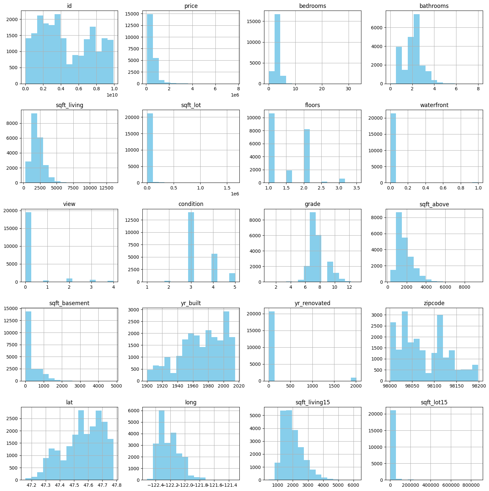
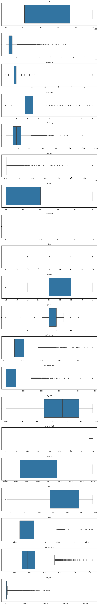
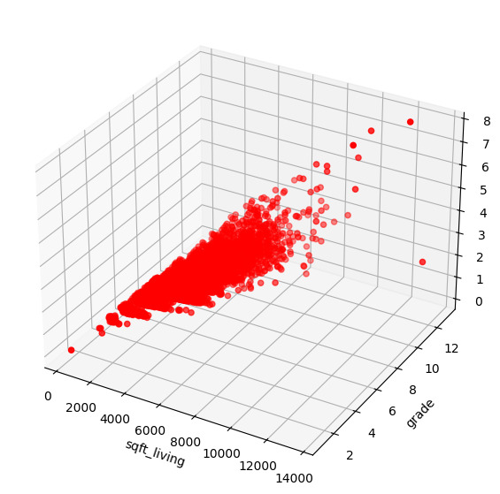
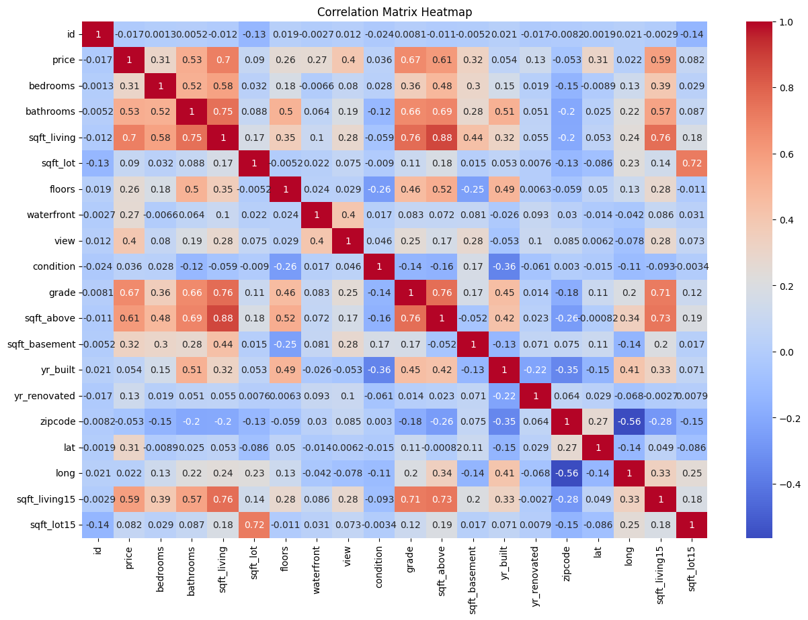

## Практическое задание № 5. Задача восстановлении регрессии

Ф.И.О Студента: **Мерич Дорук Каймакджыоглу**

Студ №: **1032204917**

1. Загрузить набор данных по прогнозированию стоимости
недвижмости [набор данных (house data)](https://www.kaggle.com/datasets/harlfoxem/housesalesprediction?datasetId=128&sortBy=voteCount) как датафрейм библиотеки pandas
2. Получить представлении о наборе данных с помощью методов shape, head, describe, info библиотеки pandas. Посчитать количество пустых значений в признаках с помощью библиотеки numpy
3. Произвести разведочный анализ данных по данному набору данных – визуализировать данные с помощью библиотек matplotlib, seaborn, plotly.
Построить:
    1) Гистограммы
    2) Ящик с усами (диаграмма размаха)
    3) Точечные 3D-графики распределения признаков
    4) Тепловая карта корреляционной матрицы
4. На основе выполненного анализа данных произвести выводы о влиянии различных характеристик на стоимость недвижимости
5. Объединить значения по периодам в признаках даты постройки и даты последнего капитального ремонта. Произвести нормализацию данных. Разбить обработанный набор данных на обучающую и тестовую выборки с помощью метода train_test_split библиотеки sklearn
6. Произвести обучение следующих моделей библиотеки sklearn:
    1) Линейная регрессия (Linear Regression)
    2) Регрессия LASSO (Lasso Regression)
    3) Регрессия Ridge (Ridge Regression)
    4) Полиномиальная регрессия (Polynomial Regression)
7. Отобразить точность работы каждой модели на тестовой и обучающей выборках с помощью метрик r squared (р-квадрат, коэффициент детерминации), mean absolute error(средняя абсолютная ошибка), mean squared error (средняя квадратичная ошибка) библиотеки sklearn
8. Повторно отобразить метрики после проведения кросс-валидаци
9. Произвести поиск оптимальных гиперпараметров с помощью метода GridSearchCV по модели с наилучшими показателями.


```python
import pandas as pd
import numpy as np
import matplotlib.pyplot as plt
import seaborn as sns

data = pd.read_csv('datasets_ml/kc_house_data.csv')

print("---- Creditcard Data ----")
print("Shape of the dataset:", data.shape)
print("\nFirst 5 rows:\n", data.head())
print("\nData Description:\n", data.describe())
print("\nData Information:")
data.info()
```

    ---- Creditcard Data ----
    Shape of the dataset: (21613, 21)
    
    First 5 rows:
                id             date     price  bedrooms  bathrooms  sqft_living  \
    0  7129300520  20141013T000000  221900.0         3       1.00         1180   
    1  6414100192  20141209T000000  538000.0         3       2.25         2570   
    2  5631500400  20150225T000000  180000.0         2       1.00          770   
    3  2487200875  20141209T000000  604000.0         4       3.00         1960   
    4  1954400510  20150218T000000  510000.0         3       2.00         1680   
    
       sqft_lot  floors  waterfront  view  ...  grade  sqft_above  sqft_basement  \
    0      5650     1.0           0     0  ...      7        1180              0   
    1      7242     2.0           0     0  ...      7        2170            400   
    2     10000     1.0           0     0  ...      6         770              0   
    3      5000     1.0           0     0  ...      7        1050            910   
    4      8080     1.0           0     0  ...      8        1680              0   
    
       yr_built  yr_renovated  zipcode      lat     long  sqft_living15  \
    0      1955             0    98178  47.5112 -122.257           1340   
    1      1951          1991    98125  47.7210 -122.319           1690   
    2      1933             0    98028  47.7379 -122.233           2720   
    3      1965             0    98136  47.5208 -122.393           1360   
    4      1987             0    98074  47.6168 -122.045           1800   
    
       sqft_lot15  
    0        5650  
    1        7639  
    2        8062  
    3        5000  
    4        7503  
    
    [5 rows x 21 columns]
    
    Data Description:
                      id         price      bedrooms     bathrooms   sqft_living  \
    count  2.161300e+04  2.161300e+04  21613.000000  21613.000000  21613.000000   
    mean   4.580302e+09  5.400881e+05      3.370842      2.114757   2079.899736   
    std    2.876566e+09  3.671272e+05      0.930062      0.770163    918.440897   
    min    1.000102e+06  7.500000e+04      0.000000      0.000000    290.000000   
    25%    2.123049e+09  3.219500e+05      3.000000      1.750000   1427.000000   
    50%    3.904930e+09  4.500000e+05      3.000000      2.250000   1910.000000   
    75%    7.308900e+09  6.450000e+05      4.000000      2.500000   2550.000000   
    max    9.900000e+09  7.700000e+06     33.000000      8.000000  13540.000000   
    
               sqft_lot        floors    waterfront          view     condition  \
    count  2.161300e+04  21613.000000  21613.000000  21613.000000  21613.000000   
    mean   1.510697e+04      1.494309      0.007542      0.234303      3.409430   
    std    4.142051e+04      0.539989      0.086517      0.766318      0.650743   
    min    5.200000e+02      1.000000      0.000000      0.000000      1.000000   
    25%    5.040000e+03      1.000000      0.000000      0.000000      3.000000   
    50%    7.618000e+03      1.500000      0.000000      0.000000      3.000000   
    75%    1.068800e+04      2.000000      0.000000      0.000000      4.000000   
    max    1.651359e+06      3.500000      1.000000      4.000000      5.000000   
    
                  grade    sqft_above  sqft_basement      yr_built  yr_renovated  \
    count  21613.000000  21613.000000   21613.000000  21613.000000  21613.000000   
    mean       7.656873   1788.390691     291.509045   1971.005136     84.402258   
    std        1.175459    828.090978     442.575043     29.373411    401.679240   
    min        1.000000    290.000000       0.000000   1900.000000      0.000000   
    25%        7.000000   1190.000000       0.000000   1951.000000      0.000000   
    50%        7.000000   1560.000000       0.000000   1975.000000      0.000000   
    75%        8.000000   2210.000000     560.000000   1997.000000      0.000000   
    max       13.000000   9410.000000    4820.000000   2015.000000   2015.000000   
    
                zipcode           lat          long  sqft_living15     sqft_lot15  
    count  21613.000000  21613.000000  21613.000000   21613.000000   21613.000000  
    mean   98077.939805     47.560053   -122.213896    1986.552492   12768.455652  
    std       53.505026      0.138564      0.140828     685.391304   27304.179631  
    min    98001.000000     47.155900   -122.519000     399.000000     651.000000  
    25%    98033.000000     47.471000   -122.328000    1490.000000    5100.000000  
    50%    98065.000000     47.571800   -122.230000    1840.000000    7620.000000  
    75%    98118.000000     47.678000   -122.125000    2360.000000   10083.000000  
    max    98199.000000     47.777600   -121.315000    6210.000000  871200.000000  
    
    Data Information:
    <class 'pandas.core.frame.DataFrame'>
    RangeIndex: 21613 entries, 0 to 21612
    Data columns (total 21 columns):
     #   Column         Non-Null Count  Dtype  
    ---  ------         --------------  -----  
     0   id             21613 non-null  int64  
     1   date           21613 non-null  object 
     2   price          21613 non-null  float64
     3   bedrooms       21613 non-null  int64  
     4   bathrooms      21613 non-null  float64
     5   sqft_living    21613 non-null  int64  
     6   sqft_lot       21613 non-null  int64  
     7   floors         21613 non-null  float64
     8   waterfront     21613 non-null  int64  
     9   view           21613 non-null  int64  
     10  condition      21613 non-null  int64  
     11  grade          21613 non-null  int64  
     12  sqft_above     21613 non-null  int64  
     13  sqft_basement  21613 non-null  int64  
     14  yr_built       21613 non-null  int64  
     15  yr_renovated   21613 non-null  int64  
     16  zipcode        21613 non-null  int64  
     17  lat            21613 non-null  float64
     18  long           21613 non-null  float64
     19  sqft_living15  21613 non-null  int64  
     20  sqft_lot15     21613 non-null  int64  
    dtypes: float64(5), int64(15), object(1)
    memory usage: 3.5+ MB
    


```python
data.isnull().sum()
```


    id               0
    date             0
    price            0
    bedrooms         0
    bathrooms        0
    sqft_living      0
    sqft_lot         0
    floors           0
    waterfront       0
    view             0
    condition        0
    grade            0
    sqft_above       0
    sqft_basement    0
    yr_built         0
    yr_renovated     0
    zipcode          0
    lat              0
    long             0
    sqft_living15    0
    sqft_lot15       0
    dtype: int64


#### **Гистограммы**


```python
numerical_columns = data.select_dtypes(include=['float64', 'int64']).columns
data[numerical_columns].hist(bins=15, figsize=(15, 15), layout=(5, 4), color='skyblue')
plt.tight_layout()
plt.show()
```


    

    


#### **Ящик с усами (диаграмма размаха)**


```python
numerical_columns = data.select_dtypes(include=['float64', 'int64']).columns
fig, ax = plt.subplots(len(numerical_columns), 1, figsize=(10, 60))
for i, column in enumerate(numerical_columns):
    sns.boxplot(x=data[column], ax=ax[i])
    ax[i].set_title(f'{column}', fontsize=10)
    ax[i].set_xlabel('')
plt.tight_layout()
plt.show()
```


    

    


#### **Точечные 3D-графики распределения признаков**


```python
fig = plt.figure(figsize=(10, 7))
ax = fig.add_subplot(111, projection='3d')

xs = data['sqft_living']
ys = data['grade']
zs = data['price']
ax.scatter(xs, ys, zs, c='r', marker='o')

ax.set_xlabel('sqft_living')
ax.set_ylabel('grade')
ax.set_zlabel('price')

plt.show()
```


    

    


#### **Тепловая карта корреляционной матрицы**


```python
plt.figure(figsize=(15, 10))
numeric_data = data.select_dtypes(include=[np.number])
correlation_matrix = numeric_data.corr()
sns.heatmap(correlation_matrix, annot=True, cmap='coolwarm')
plt.title('Correlation Matrix Heatmap')
plt.show()
```


    

    


```python
price_correlation = correlation_matrix['price'].sort_values(ascending=False)
price_correlation
```


    price            1.000000
    sqft_living      0.702035
    grade            0.667434
    sqft_above       0.605567
    sqft_living15    0.585379
    bathrooms        0.525138
    view             0.397293
    sqft_basement    0.323816
    bedrooms         0.308350
    lat              0.307003
    waterfront       0.266369
    floors           0.256794
    yr_renovated     0.126434
    sqft_lot         0.089661
    sqft_lot15       0.082447
    yr_built         0.054012
    condition        0.036362
    long             0.021626
    id              -0.016762
    zipcode         -0.053203
    Name: price, dtype: float64


```python
from sklearn.preprocessing import MinMaxScaler
from sklearn.model_selection import train_test_split

data['date'] = pd.to_datetime(data['date']).dt.year
# !!!!!!!!!!!!!!!!!!!!!!!!!!!!!!!!!!!!!!!!!!!!!!!!!!!!!!!!!!!!!!!!!!!!!!!!!!!!!!!!!!!!!!!!!!!!!!!!!!!!!!!!!!!!!!!!!!!!!!!!!!!!!!!!!!!!!!!!!!!!!!!!!!
# я не могу объединить значения по периодам в признаках даты постройки и даты там есть буг в юпитере который работает и потом не работает не понятно
# последнего капитального ремонта.
# !!!!!!!!!!!!!!!!!!!!!!!!!!!!!!!!!!!!!!!!!!!!!!!!!!!!!!!!!!!!!!!!!!!!!!!!!!!!!!!!!!!!!!!!!!!!!!!!!!!!!!!!!!!!!!!!!!!!!!!!!!!!!!!!!!!!!!!!!!!!!!!!!!
scaler = MinMaxScaler()
data_scaled = pd.DataFrame(scaler.fit_transform(data.drop(['id', 'price'], axis=1)), columns=data.columns[2:])

X = data_scaled
y = data['price']
X_train, X_test, y_train, y_test = train_test_split(X, y, test_size=0.2, random_state=42)

X_train.shape, X_test.shape, y_train.shape, y_test.shape
```


    ((17290, 27), (4323, 27), (17290,), (4323,))


```python
from sklearn.linear_model import LinearRegression, Lasso, Ridge
from sklearn.preprocessing import PolynomialFeatures
from sklearn.metrics import mean_squared_error, mean_absolute_error, r2_score
from sklearn.model_selection import cross_val_score

def evaluate_model(model, X_train, y_train, X_test, y_test):
    y_train_pred = model.predict(X_train)
    y_test_pred = model.predict(X_test)
    
    metrics = {
        'Training R^2': r2_score(y_train, y_train_pred),
        'Testing R^2': r2_score(y_test, y_test_pred),
        'Training MAE': mean_absolute_error(y_train, y_train_pred),
        'Testing MAE': mean_absolute_error(y_test, y_test_pred),
        'Training MSE': mean_squared_error(y_train, y_train_pred),
        'Testing MSE': mean_squared_error(y_test, y_test_pred)
    }
    return metrics

def cross_validate_model(model, X, y, cv=5):
    scores_r2 = cross_val_score(model, X, y, cv=cv, scoring='r2')
    scores_mae = cross_val_score(model, X, y, cv=cv, scoring='neg_mean_absolute_error')
    scores_mse = cross_val_score(model, X, y, cv=cv, scoring='neg_mean_squared_error')

    metrics_cv = {
        'Average R^2': np.mean(scores_r2),
        'Average MAE': -np.mean(scores_mae),
        'Average MSE': -np.mean(scores_mse)
    }
    return metrics_cv
```

#### **Линейная регрессия (Linear Regression)**


```python
linear_model = LinearRegression()
linear_model.fit(X_train, y_train)
linear_metrics = evaluate_model(linear_model, X_train, y_train, X_test, y_test)
linear_metrics
```


    {'Training R^2': 0.7035448170656414,
     'Testing R^2': 0.7064175437681701,
     'Training MAE': 124310.94141122035,
     'Testing MAE': 126905.11936155448,
     'Training MSE': 38731458690.073166,
     'Testing MSE': 44382830509.42054}


```python
linear_metrics_cv = cross_validate_model(linear_model, X, y)
linear_metrics_cv
```


    {'Average R^2': 0.7000193951635808,
     'Average MAE': 126069.39253084427,
     'Average MSE': 40374179818.073074}


#### **Регрессия LASSO (Lasso Regression)**


```python
lasso_model = Lasso(alpha=1.0, tol=0.001)
lasso_model.fit(X_train, y_train)
lasso_metrics = evaluate_model(lasso_model, X_train, y_train, X_test, y_test)
lasso_metrics
```

    C:\Users\Meric\AppData\Roaming\Python\Python311\site-packages\sklearn\linear_model\_coordinate_descent.py:678: ConvergenceWarning: Objective did not converge. You might want to increase the number of iterations, check the scale of the features or consider increasing regularisation. Duality gap: 1.589e+14, tolerance: 2.259e+12
      model = cd_fast.enet_coordinate_descent(
    


    {'Training R^2': 0.7035550934724024,
     'Testing R^2': 0.7063830765277226,
     'Training MAE': 124331.4806148452,
     'Testing MAE': 126951.30696906844,
     'Training MSE': 38730116091.77549,
     'Testing MSE': 44388041153.511955}


```python
lasso_metrics_cv = cross_validate_model(lasso_model, X, y)
lasso_metrics_cv
```

    C:\Users\Meric\AppData\Roaming\Python\Python311\site-packages\sklearn\linear_model\_coordinate_descent.py:678: ConvergenceWarning: Objective did not converge. You might want to increase the number of iterations, check the scale of the features or consider increasing regularisation. Duality gap: 1.575e+14, tolerance: 2.258e+12
      model = cd_fast.enet_coordinate_descent(
    


    ---------------------------------------------------------------------------

    KeyboardInterrupt                         Traceback (most recent call last)

    Cell In[97], line 1
    ----> 1 lasso_metrics_cv = cross_validate_model(lasso_model, X, y)
          2 lasso_metrics_cv
    

    Cell In[93], line 21, in cross_validate_model(model, X, y, cv)
         20 def cross_validate_model(model, X, y, cv=5):
    ---> 21     scores_r2 = cross_val_score(model, X, y, cv=cv, scoring='r2')
         22     scores_mae = cross_val_score(model, X, y, cv=cv, scoring='neg_mean_absolute_error')
         23     scores_mse = cross_val_score(model, X, y, cv=cv, scoring='neg_mean_squared_error')
    

    File ~\AppData\Roaming\Python\Python311\site-packages\sklearn\utils\_param_validation.py:213, in validate_params.<locals>.decorator.<locals>.wrapper(*args, **kwargs)
        207 try:
        208     with config_context(
        209         skip_parameter_validation=(
        210             prefer_skip_nested_validation or global_skip_validation
        211         )
        212     ):
    --> 213         return func(*args, **kwargs)
        214 except InvalidParameterError as e:
        215     # When the function is just a wrapper around an estimator, we allow
        216     # the function to delegate validation to the estimator, but we replace
        217     # the name of the estimator by the name of the function in the error
        218     # message to avoid confusion.
        219     msg = re.sub(
        220         r"parameter of \w+ must be",
        221         f"parameter of {func.__qualname__} must be",
        222         str(e),
        223     )
    

    File ~\AppData\Roaming\Python\Python311\site-packages\sklearn\model_selection\_validation.py:719, in cross_val_score(estimator, X, y, groups, scoring, cv, n_jobs, verbose, fit_params, params, pre_dispatch, error_score)
        716 # To ensure multimetric format is not supported
        717 scorer = check_scoring(estimator, scoring=scoring)
    --> 719 cv_results = cross_validate(
        720     estimator=estimator,
        721     X=X,
        722     y=y,
        723     groups=groups,
        724     scoring={"score": scorer},
        725     cv=cv,
        726     n_jobs=n_jobs,
        727     verbose=verbose,
        728     fit_params=fit_params,
        729     params=params,
        730     pre_dispatch=pre_dispatch,
        731     error_score=error_score,
        732 )
        733 return cv_results["test_score"]
    

    File ~\AppData\Roaming\Python\Python311\site-packages\sklearn\utils\_param_validation.py:213, in validate_params.<locals>.decorator.<locals>.wrapper(*args, **kwargs)
        207 try:
        208     with config_context(
        209         skip_parameter_validation=(
        210             prefer_skip_nested_validation or global_skip_validation
        211         )
        212     ):
    --> 213         return func(*args, **kwargs)
        214 except InvalidParameterError as e:
        215     # When the function is just a wrapper around an estimator, we allow
        216     # the function to delegate validation to the estimator, but we replace
        217     # the name of the estimator by the name of the function in the error
        218     # message to avoid confusion.
        219     msg = re.sub(
        220         r"parameter of \w+ must be",
        221         f"parameter of {func.__qualname__} must be",
        222         str(e),
        223     )
    

    File ~\AppData\Roaming\Python\Python311\site-packages\sklearn\model_selection\_validation.py:430, in cross_validate(estimator, X, y, groups, scoring, cv, n_jobs, verbose, fit_params, params, pre_dispatch, return_train_score, return_estimator, return_indices, error_score)
        427 # We clone the estimator to make sure that all the folds are
        428 # independent, and that it is pickle-able.
        429 parallel = Parallel(n_jobs=n_jobs, verbose=verbose, pre_dispatch=pre_dispatch)
    --> 430 results = parallel(
        431     delayed(_fit_and_score)(
        432         clone(estimator),
        433         X,
        434         y,
        435         scorer=scorers,
        436         train=train,
        437         test=test,
        438         verbose=verbose,
        439         parameters=None,
        440         fit_params=routed_params.estimator.fit,
        441         score_params=routed_params.scorer.score,
        442         return_train_score=return_train_score,
        443         return_times=True,
        444         return_estimator=return_estimator,
        445         error_score=error_score,
        446     )
        447     for train, test in indices
        448 )
        450 _warn_or_raise_about_fit_failures(results, error_score)
        452 # For callable scoring, the return type is only know after calling. If the
        453 # return type is a dictionary, the error scores can now be inserted with
        454 # the correct key.
    

    File ~\AppData\Roaming\Python\Python311\site-packages\sklearn\utils\parallel.py:67, in Parallel.__call__(self, iterable)
         62 config = get_config()
         63 iterable_with_config = (
         64     (_with_config(delayed_func, config), args, kwargs)
         65     for delayed_func, args, kwargs in iterable
         66 )
    ---> 67 return super().__call__(iterable_with_config)
    

    File ~\AppData\Roaming\Python\Python311\site-packages\joblib\parallel.py:1863, in Parallel.__call__(self, iterable)
       1861     output = self._get_sequential_output(iterable)
       1862     next(output)
    -> 1863     return output if self.return_generator else list(output)
       1865 # Let's create an ID that uniquely identifies the current call. If the
       1866 # call is interrupted early and that the same instance is immediately
       1867 # re-used, this id will be used to prevent workers that were
       1868 # concurrently finalizing a task from the previous call to run the
       1869 # callback.
       1870 with self._lock:
    

    File ~\AppData\Roaming\Python\Python311\site-packages\joblib\parallel.py:1792, in Parallel._get_sequential_output(self, iterable)
       1790 self.n_dispatched_batches += 1
       1791 self.n_dispatched_tasks += 1
    -> 1792 res = func(*args, **kwargs)
       1793 self.n_completed_tasks += 1
       1794 self.print_progress()
    

    File ~\AppData\Roaming\Python\Python311\site-packages\sklearn\utils\parallel.py:129, in _FuncWrapper.__call__(self, *args, **kwargs)
        127     config = {}
        128 with config_context(**config):
    --> 129     return self.function(*args, **kwargs)
    

    File ~\AppData\Roaming\Python\Python311\site-packages\sklearn\model_selection\_validation.py:895, in _fit_and_score(estimator, X, y, scorer, train, test, verbose, parameters, fit_params, score_params, return_train_score, return_parameters, return_n_test_samples, return_times, return_estimator, split_progress, candidate_progress, error_score)
        893         estimator.fit(X_train, **fit_params)
        894     else:
    --> 895         estimator.fit(X_train, y_train, **fit_params)
        897 except Exception:
        898     # Note fit time as time until error
        899     fit_time = time.time() - start_time
    

    File ~\AppData\Roaming\Python\Python311\site-packages\sklearn\base.py:1474, in _fit_context.<locals>.decorator.<locals>.wrapper(estimator, *args, **kwargs)
       1467     estimator._validate_params()
       1469 with config_context(
       1470     skip_parameter_validation=(
       1471         prefer_skip_nested_validation or global_skip_validation
       1472     )
       1473 ):
    -> 1474     return fit_method(estimator, *args, **kwargs)
    

    File ~\AppData\Roaming\Python\Python311\site-packages\sklearn\linear_model\_coordinate_descent.py:1050, in ElasticNet.fit(self, X, y, sample_weight, check_input)
       1048 else:
       1049     this_Xy = None
    -> 1050 _, this_coef, this_dual_gap, this_iter = self.path(
       1051     X,
       1052     y[:, k],
       1053     l1_ratio=self.l1_ratio,
       1054     eps=None,
       1055     n_alphas=None,
       1056     alphas=[alpha],
       1057     precompute=precompute,
       1058     Xy=this_Xy,
       1059     copy_X=True,
       1060     coef_init=coef_[k],
       1061     verbose=False,
       1062     return_n_iter=True,
       1063     positive=self.positive,
       1064     check_input=False,
       1065     # from here on **params
       1066     tol=self.tol,
       1067     X_offset=X_offset,
       1068     X_scale=X_scale,
       1069     max_iter=self.max_iter,
       1070     random_state=self.random_state,
       1071     selection=self.selection,
       1072     sample_weight=sample_weight,
       1073 )
       1074 coef_[k] = this_coef[:, 0]
       1075 dual_gaps_[k] = this_dual_gap[0]
    

    File ~\AppData\Roaming\Python\Python311\site-packages\sklearn\utils\_param_validation.py:186, in validate_params.<locals>.decorator.<locals>.wrapper(*args, **kwargs)
        184 global_skip_validation = get_config()["skip_parameter_validation"]
        185 if global_skip_validation:
    --> 186     return func(*args, **kwargs)
        188 func_sig = signature(func)
        190 # Map *args/**kwargs to the function signature
    

    File ~\AppData\Roaming\Python\Python311\site-packages\sklearn\linear_model\_coordinate_descent.py:678, in enet_path(X, y, l1_ratio, eps, n_alphas, alphas, precompute, Xy, copy_X, coef_init, verbose, return_n_iter, positive, check_input, **params)
        664     model = cd_fast.enet_coordinate_descent_gram(
        665         coef_,
        666         l1_reg,
       (...)
        675         positive,
        676     )
        677 elif precompute is False:
    --> 678     model = cd_fast.enet_coordinate_descent(
        679         coef_, l1_reg, l2_reg, X, y, max_iter, tol, rng, random, positive
        680     )
        681 else:
        682     raise ValueError(
        683         "Precompute should be one of True, False, 'auto' or array-like. Got %r"
        684         % precompute
        685     )
    

    File sklearn\\linear_model\\_cd_fast.pyx:265, in sklearn.linear_model._cd_fast.enet_coordinate_descent()
    

    File ~\AppData\Roaming\Python\Python311\site-packages\numpy\core\getlimits.py:484, in finfo.__new__(cls, dtype)
        380 """
        381 finfo(dtype)
        382 
       (...)
        479 
        480 """
        482 _finfo_cache = {}
    --> 484 def __new__(cls, dtype):
        485     try:
        486         obj = cls._finfo_cache.get(dtype)  # most common path
    

    KeyboardInterrupt: 


#### **Регрессия Ridge (Ridge Regression)**


```python
ridge_model = Ridge(alpha=1.0)
ridge_model.fit(X_train, y_train)
ridge_metrics = evaluate_model(ridge_model, X_train, y_train, X_test, y_test)
ridge_metrics
```


    {'Training R^2': 0.7034758119594249,
     'Testing R^2': 0.705901039036333,
     'Training MAE': 124075.30516769447,
     'Testing MAE': 126801.8688576923,
     'Training MSE': 38740474111.54218,
     'Testing MSE': 44460913996.6448}


```python
ridge_metrics_cv = cross_validate_model(ridge_model, X, y)
ridge_metrics_cv
```


    {'Average R^2': 0.7006545923019745,
     'Average MAE': 125606.51605204942,
     'Average MSE': 40305328628.59536}


#### **Полиномиальная регрессия (Polynomial Regression)**


```python
poly_features = PolynomialFeatures(degree=2)
X_train_poly = poly_features.fit_transform(X_train)
X_test_poly = poly_features.transform(X_test)
poly_model = LinearRegression()
poly_model.fit(X_train_poly, y_train)
poly_metrics = evaluate_model(poly_model, X_train_poly, y_train, X_test_poly, y_test)
poly_metrics
```


    {'Training R^2': 0.8434302405559981,
     'Testing R^2': -6.590285647352696e+19,
     'Training MAE': 95176.58421052631,
     'Testing MAE': 48006710757079.22,
     'Training MSE': 20455622026.897686,
     'Testing MSE': 9.962977170003303e+30}


```python
X_poly = poly_features.fit_transform(X) # scaled data
poly_metrics_cv = cross_validate_model(LinearRegression(), X_poly, y)
poly_metrics_cv
```


    {'Average R^2': -1.7125768910283152e+20,
     'Average MAE': 32993793275802.76,
     'Average MSE': 2.3524438287553973e+31}


```python
from sklearn.model_selection import GridSearchCV

param_grid = {
    'alpha': [0.1, 1, 10, 100, 200],
    'solver': ['auto', 'svd', 'cholesky', 'lsqr', 'sparse_cg', 'sag', 'saga']
}
ridge = Ridge()
grid_search = GridSearchCV(estimator=ridge, param_grid=param_grid, cv=5, n_jobs=-1, scoring='r2')
grid_search.fit(X_train, y_train)
best_params = grid_search.best_params_
best_score = grid_search.best_score_

best_params
```


    {'alpha': 1, 'solver': 'lsqr'}


```python
best_score
```


    0.7022277676886557


```python

```
