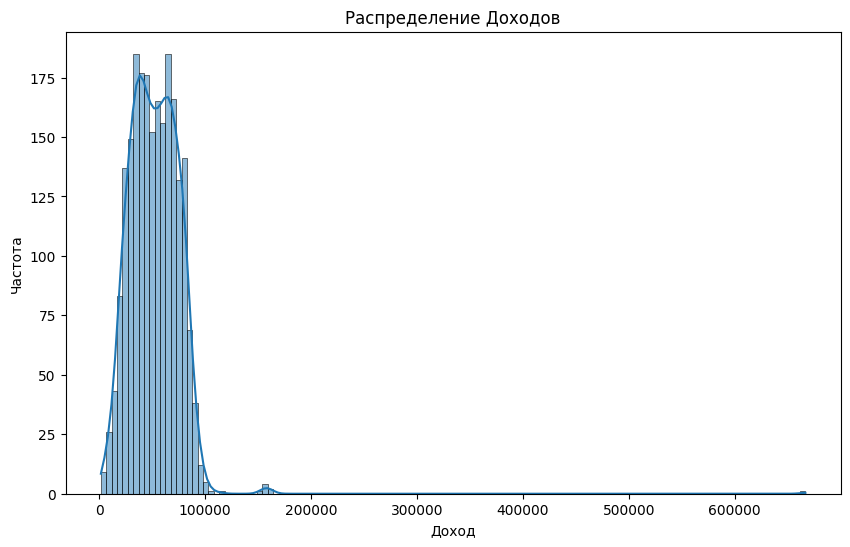
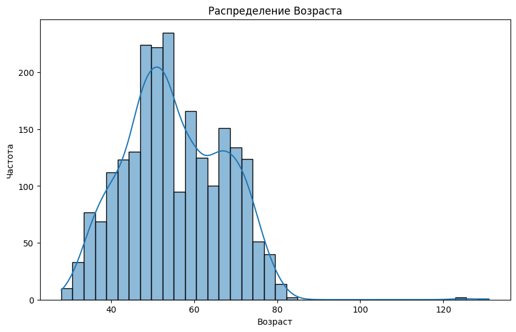
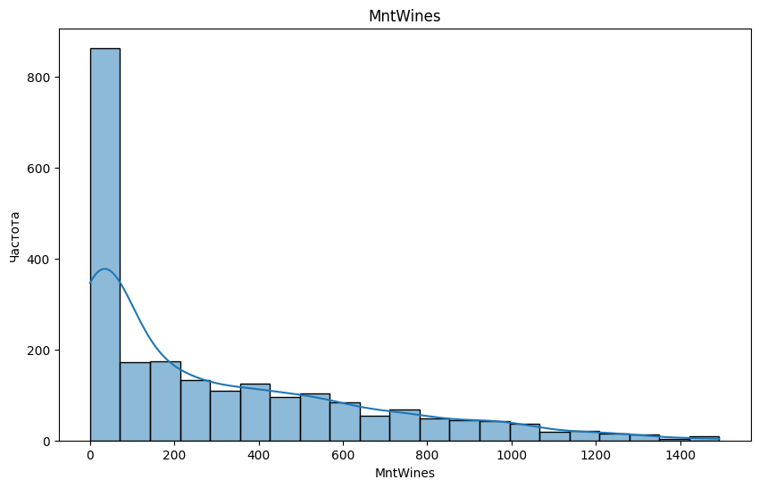
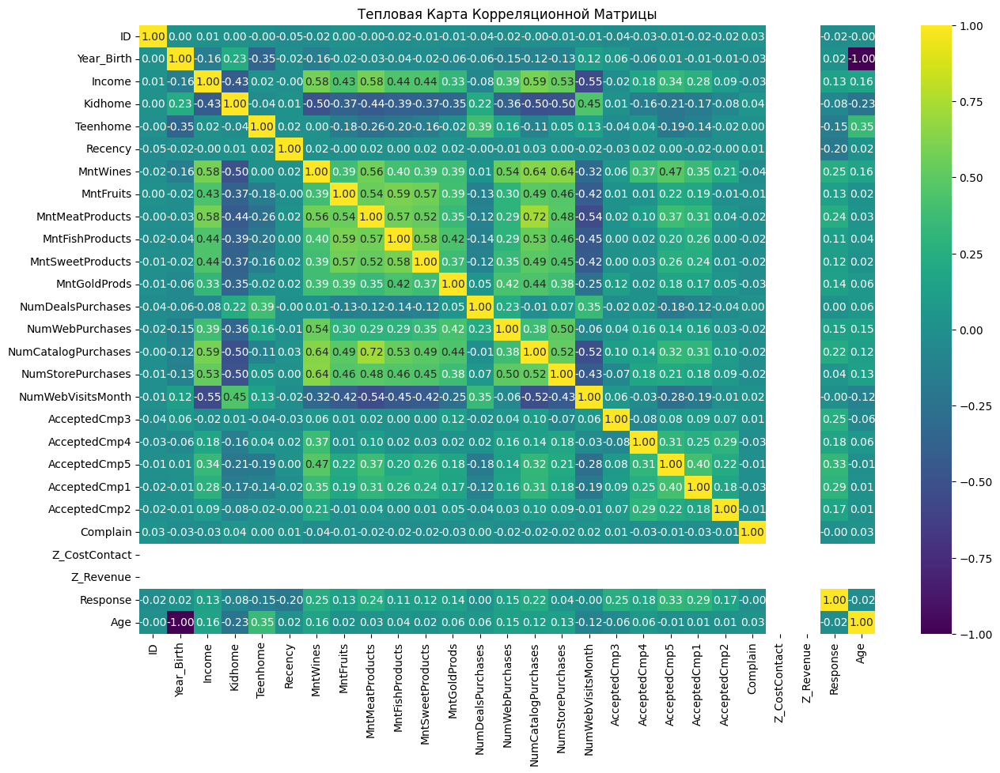
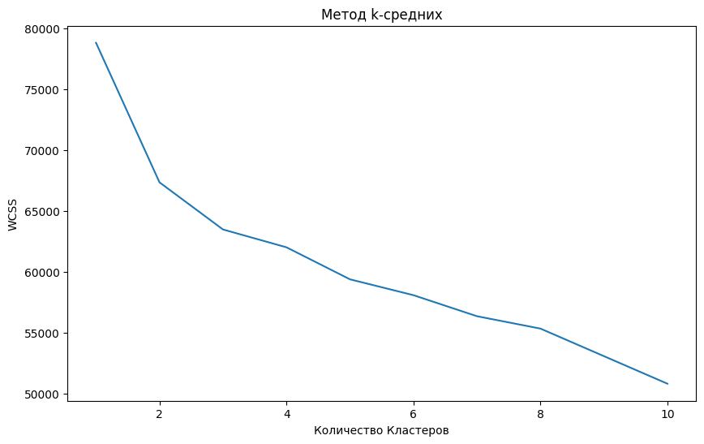

## Практическое задание № 6. Задача кластеризации

Ф.И.О Студента: **Мерич Дорук Каймакджыоглу**

Студ №: **1032204917**

1. Загрузить набор данных сегментации покупателей по индивидуальным особенностям [набор данных (marketing campaing)](https://www.kaggle.com/datasets/imakash3011/customer-personality-analysis) как датафрейм библиотеки pandas
2. Получить представлении о наборе данных с помощью методов shape, head, describe, info библиотеки pandas. Посчитать количество пустых значений в признаках с помощью библиотеки numpy
3. Произвести разведочный анализ данных по данному набору данных – визуализировать данные с помощью библиотек matplotlib, seaborn, plotly.
Построить:
    1) Графики распределения признаков
    2) Тепловая карта корреляционной матрицы
4. На основе выполненного анализа данных произвести выводы о распределении индивидуальных качеств покупателей
5. Закодировать категориальные данные в дискретные величины, произвести скалярную стандартизацию данных
6. Произвести снижение размерности набора данных
7. Произвести обучение следующих моделей библиотеки sklearn:
    1) Метод k-средних (k-means clustering)
8. Произвести разведочный анализ данных по кластерам для оценки качества обучения модели.


```python
import pandas as pd
import numpy as np
import matplotlib.pyplot as plt
import seaborn as sns

data = pd.read_csv('datasets_ml/marketing_campaign.csv', delimiter='\t')

print("---- Creditcard Data ----")
print("Shape of the dataset:", data.shape)
print("\nFirst 5 rows:\n", data.head())
print("\nData Description:\n", data.describe())
print("\nData Information:")
data.info()
```

    ---- Creditcard Data ----
    Shape of the dataset: (2240, 29)
    
    First 5 rows:
          ID  Year_Birth   Education Marital_Status   Income  Kidhome  Teenhome  \
    0  5524        1957  Graduation         Single  58138.0        0         0   
    1  2174        1954  Graduation         Single  46344.0        1         1   
    2  4141        1965  Graduation       Together  71613.0        0         0   
    3  6182        1984  Graduation       Together  26646.0        1         0   
    4  5324        1981         PhD        Married  58293.0        1         0   
    
      Dt_Customer  Recency  MntWines  ...  NumWebVisitsMonth  AcceptedCmp3  \
    0  04-09-2012       58       635  ...                  7             0   
    1  08-03-2014       38        11  ...                  5             0   
    2  21-08-2013       26       426  ...                  4             0   
    3  10-02-2014       26        11  ...                  6             0   
    4  19-01-2014       94       173  ...                  5             0   
    
       AcceptedCmp4  AcceptedCmp5  AcceptedCmp1  AcceptedCmp2  Complain  \
    0             0             0             0             0         0   
    1             0             0             0             0         0   
    2             0             0             0             0         0   
    3             0             0             0             0         0   
    4             0             0             0             0         0   
    
       Z_CostContact  Z_Revenue  Response  
    0              3         11         1  
    1              3         11         0  
    2              3         11         0  
    3              3         11         0  
    4              3         11         0  
    
    [5 rows x 29 columns]
    
    Data Description:
                      ID   Year_Birth         Income      Kidhome     Teenhome  \
    count   2240.000000  2240.000000    2216.000000  2240.000000  2240.000000   
    mean    5592.159821  1968.805804   52247.251354     0.444196     0.506250   
    std     3246.662198    11.984069   25173.076661     0.538398     0.544538   
    min        0.000000  1893.000000    1730.000000     0.000000     0.000000   
    25%     2828.250000  1959.000000   35303.000000     0.000000     0.000000   
    50%     5458.500000  1970.000000   51381.500000     0.000000     0.000000   
    75%     8427.750000  1977.000000   68522.000000     1.000000     1.000000   
    max    11191.000000  1996.000000  666666.000000     2.000000     2.000000   
    
               Recency     MntWines    MntFruits  MntMeatProducts  \
    count  2240.000000  2240.000000  2240.000000      2240.000000   
    mean     49.109375   303.935714    26.302232       166.950000   
    std      28.962453   336.597393    39.773434       225.715373   
    min       0.000000     0.000000     0.000000         0.000000   
    25%      24.000000    23.750000     1.000000        16.000000   
    50%      49.000000   173.500000     8.000000        67.000000   
    75%      74.000000   504.250000    33.000000       232.000000   
    max      99.000000  1493.000000   199.000000      1725.000000   
    
           MntFishProducts  ...  NumWebVisitsMonth  AcceptedCmp3  AcceptedCmp4  \
    count      2240.000000  ...        2240.000000   2240.000000   2240.000000   
    mean         37.525446  ...           5.316518      0.072768      0.074554   
    std          54.628979  ...           2.426645      0.259813      0.262728   
    min           0.000000  ...           0.000000      0.000000      0.000000   
    25%           3.000000  ...           3.000000      0.000000      0.000000   
    50%          12.000000  ...           6.000000      0.000000      0.000000   
    75%          50.000000  ...           7.000000      0.000000      0.000000   
    max         259.000000  ...          20.000000      1.000000      1.000000   
    
           AcceptedCmp5  AcceptedCmp1  AcceptedCmp2     Complain  Z_CostContact  \
    count   2240.000000   2240.000000   2240.000000  2240.000000         2240.0   
    mean       0.072768      0.064286      0.013393     0.009375            3.0   
    std        0.259813      0.245316      0.114976     0.096391            0.0   
    min        0.000000      0.000000      0.000000     0.000000            3.0   
    25%        0.000000      0.000000      0.000000     0.000000            3.0   
    50%        0.000000      0.000000      0.000000     0.000000            3.0   
    75%        0.000000      0.000000      0.000000     0.000000            3.0   
    max        1.000000      1.000000      1.000000     1.000000            3.0   
    
           Z_Revenue     Response  
    count     2240.0  2240.000000  
    mean        11.0     0.149107  
    std          0.0     0.356274  
    min         11.0     0.000000  
    25%         11.0     0.000000  
    50%         11.0     0.000000  
    75%         11.0     0.000000  
    max         11.0     1.000000  
    
    [8 rows x 26 columns]
    
    Data Information:
    <class 'pandas.core.frame.DataFrame'>
    RangeIndex: 2240 entries, 0 to 2239
    Data columns (total 29 columns):
     #   Column               Non-Null Count  Dtype  
    ---  ------               --------------  -----  
     0   ID                   2240 non-null   int64  
     1   Year_Birth           2240 non-null   int64  
     2   Education            2240 non-null   object 
     3   Marital_Status       2240 non-null   object 
     4   Income               2216 non-null   float64
     5   Kidhome              2240 non-null   int64  
     6   Teenhome             2240 non-null   int64  
     7   Dt_Customer          2240 non-null   object 
     8   Recency              2240 non-null   int64  
     9   MntWines             2240 non-null   int64  
     10  MntFruits            2240 non-null   int64  
     11  MntMeatProducts      2240 non-null   int64  
     12  MntFishProducts      2240 non-null   int64  
     13  MntSweetProducts     2240 non-null   int64  
     14  MntGoldProds         2240 non-null   int64  
     15  NumDealsPurchases    2240 non-null   int64  
     16  NumWebPurchases      2240 non-null   int64  
     17  NumCatalogPurchases  2240 non-null   int64  
     18  NumStorePurchases    2240 non-null   int64  
     19  NumWebVisitsMonth    2240 non-null   int64  
     20  AcceptedCmp3         2240 non-null   int64  
     21  AcceptedCmp4         2240 non-null   int64  
     22  AcceptedCmp5         2240 non-null   int64  
     23  AcceptedCmp1         2240 non-null   int64  
     24  AcceptedCmp2         2240 non-null   int64  
     25  Complain             2240 non-null   int64  
     26  Z_CostContact        2240 non-null   int64  
     27  Z_Revenue            2240 non-null   int64  
     28  Response             2240 non-null   int64  
    dtypes: float64(1), int64(25), object(3)
    memory usage: 507.6+ KB
    


```python
data.isnull().sum()
```


    ID                      0
    Year_Birth              0
    Education               0
    Marital_Status          0
    Income                 24
    Kidhome                 0
    Teenhome                0
    Dt_Customer             0
    Recency                 0
    MntWines                0
    MntFruits               0
    MntMeatProducts         0
    MntFishProducts         0
    MntSweetProducts        0
    MntGoldProds            0
    NumDealsPurchases       0
    NumWebPurchases         0
    NumCatalogPurchases     0
    NumStorePurchases       0
    NumWebVisitsMonth       0
    AcceptedCmp3            0
    AcceptedCmp4            0
    AcceptedCmp5            0
    AcceptedCmp1            0
    AcceptedCmp2            0
    Complain                0
    Z_CostContact           0
    Z_Revenue               0
    Response                0
    dtype: int64


```python
data['Age'] = 2024 - data['Year_Birth'] # for age
```

#### **Графики распределения признаков**


```python
plt.figure(figsize=(10, 6))
sns.histplot(data['Income'], kde=True)
plt.title('Распределение Доходов')
plt.xlabel('Доход')
plt.ylabel('Частота')
plt.show()
```


    

    


```python
plt.figure(figsize=(10, 6))
sns.histplot(data['Age'], kde=True)
plt.title('Распределение Возраста')
plt.xlabel('Возраст')
plt.ylabel('Частота')
plt.show()
```


    

    


```python
plt.figure(figsize=(10, 6))
sns.histplot(data['MntWines'], kde=True)
plt.title('MntWines')
plt.xlabel('MntWines')
plt.ylabel('Частота')
plt.show()
```


    

    


#### **Тепловая карта корреляционной матрицы**


```python
plt.figure(figsize=(15, 10))
numeric_data = data.select_dtypes(include=[np.number])
sns.heatmap(numeric_data.corr(), annot=True, fmt=".2f", cmap='viridis')
plt.title('Тепловая Карта Корреляционной Матрицы')
plt.show()
```


    

    


```python
from sklearn.preprocessing import OneHotEncoder, StandardScaler

categorical_cols = ['Education', 'Marital_Status']
encoder = OneHotEncoder(sparse_output=False)
encoded_categorical_data = encoder.fit_transform(data[categorical_cols])

encoded_categorical_df = pd.DataFrame(encoded_categorical_data, columns=encoder.get_feature_names_out(categorical_cols))
encoded_data = pd.concat([data.drop(categorical_cols, axis=1), encoded_categorical_df], axis=1)

numeric_data = data.select_dtypes(include=['int64', 'float64'])
numeric_data.drop(['ID', 'Year_Birth'], axis=1, inplace=True)  
combined_data = pd.concat([numeric_data, encoded_categorical_df], axis=1)
median_income = data['Income'].median()

data['Income'].fillna(median_income, inplace=True)

scaler = StandardScaler()
scaled_data = scaler.fit_transform(encoded_data.drop(['ID', 'Dt_Customer'], axis=1))

encoded_data.head(), scaled_data.shape
```


    (     ID  Year_Birth   Income  Kidhome  Teenhome Dt_Customer  Recency  \
     0  5524        1957  58138.0        0         0  04-09-2012       58   
     1  2174        1954  46344.0        1         1  08-03-2014       38   
     2  4141        1965  71613.0        0         0  21-08-2013       26   
     3  6182        1984  26646.0        1         0  10-02-2014       26   
     4  5324        1981  58293.0        1         0  19-01-2014       94   
     
        MntWines  MntFruits  MntMeatProducts  ...  Education_Master  Education_PhD  \
     0       635         88              546  ...               0.0            0.0   
     1        11          1                6  ...               0.0            0.0   
     2       426         49              127  ...               0.0            0.0   
     3        11          4               20  ...               0.0            0.0   
     4       173         43              118  ...               0.0            1.0   
     
        Marital_Status_Absurd  Marital_Status_Alone  Marital_Status_Divorced  \
     0                    0.0                   0.0                      0.0   
     1                    0.0                   0.0                      0.0   
     2                    0.0                   0.0                      0.0   
     3                    0.0                   0.0                      0.0   
     4                    0.0                   0.0                      0.0   
     
        Marital_Status_Married  Marital_Status_Single  Marital_Status_Together  \
     0                     0.0                    1.0                      0.0   
     1                     0.0                    1.0                      0.0   
     2                     0.0                    0.0                      1.0   
     3                     0.0                    0.0                      1.0   
     4                     1.0                    0.0                      0.0   
     
        Marital_Status_Widow  Marital_Status_YOLO  
     0                   0.0                  0.0  
     1                   0.0                  0.0  
     2                   0.0                  0.0  
     3                   0.0                  0.0  
     4                   0.0                  0.0  
     
     [5 rows x 41 columns],
     (2240, 39))


```python
from sklearn.decomposition import PCA

pca = PCA(n_components=0.95)

pca_data = pca.fit_transform(scaled_data)

pca_data.shape, pca.explained_variance_ratio_
```


    ((2240, 28),
     array([0.17785441, 0.0723123 , 0.05360841, 0.04568345, 0.04213287,
            0.03974893, 0.03699509, 0.03448729, 0.03313179, 0.03125374,
            0.03000001, 0.02865261, 0.02836657, 0.02746608, 0.02716518,
            0.02627192, 0.02580287, 0.02522892, 0.02342206, 0.02005678,
            0.01924048, 0.01740263, 0.0161626 , 0.01566581, 0.01446025,
            0.01417421, 0.01232626, 0.01161827]))


#### **Метод k-средних (k-means clustering)**


```python
from sklearn.cluster import KMeans

wcss = []

for i in range(1, 11):
    kmeans = KMeans(n_clusters=i, init='k-means++', random_state=42)
    kmeans.fit(pca_data)
    wcss.append(kmeans.inertia_)

plt.figure(figsize=(10, 6))
plt.plot(range(1, 11), wcss)
plt.title('Метод k-средних')
plt.xlabel('Количество Кластеров')
plt.ylabel('WCSS')
plt.show()
```


    

    


```python

```
