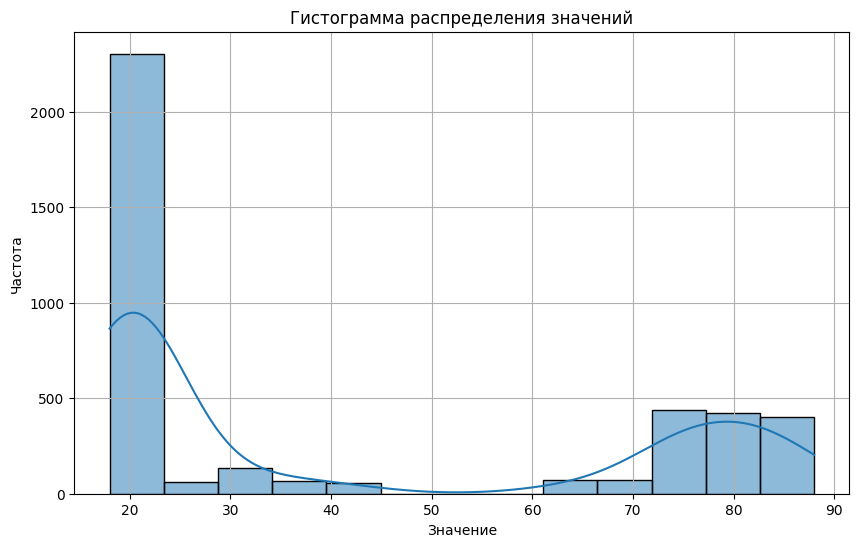
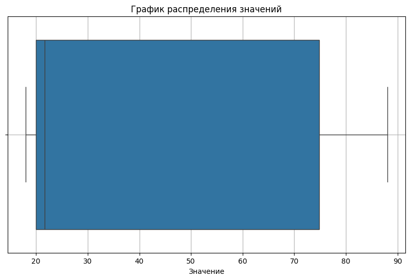
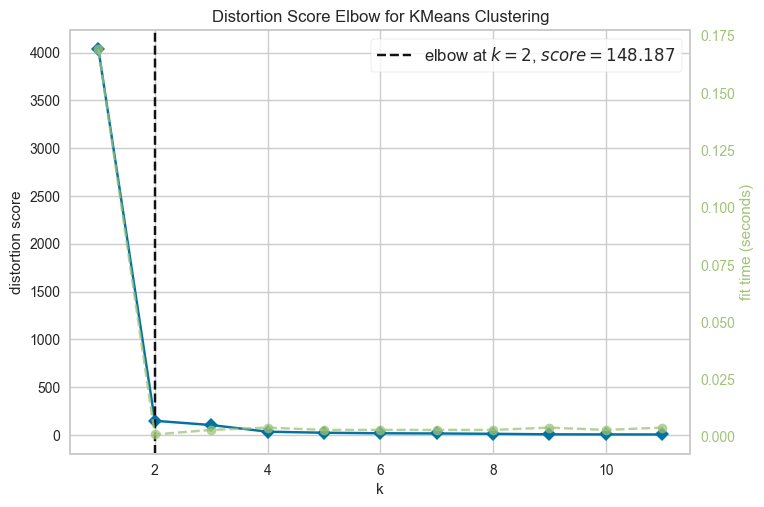
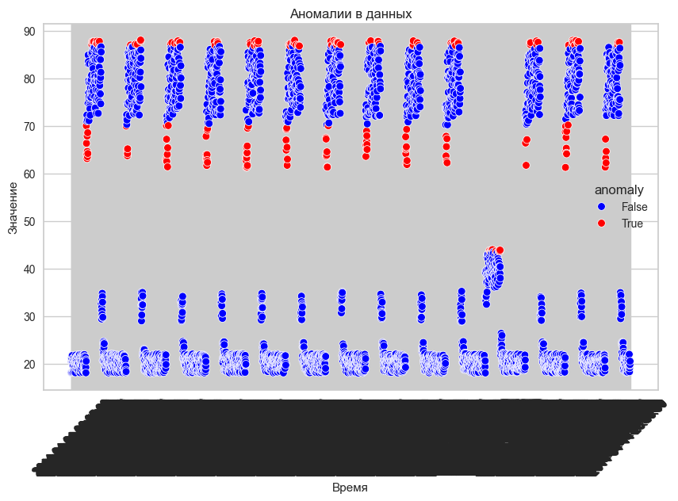
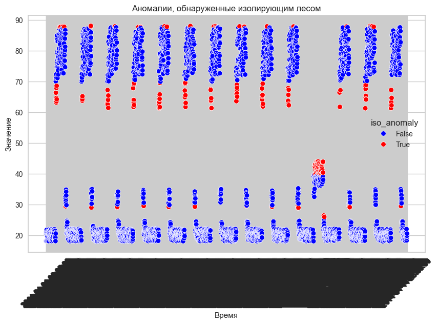
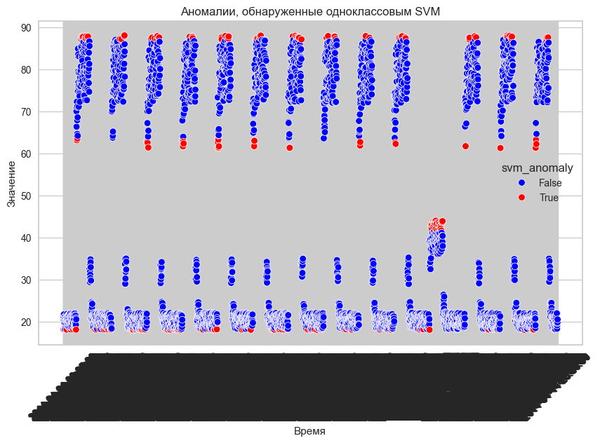

## Практическое задание № 7. Задача выявления аномалий

Ф.И.О Студента: **Мерич Дорук Каймакджыоглу**

Студ №: **1032204917**

1. Загрузить набор данных выявления аномалий [набор данных выбрано (art_daily_jumpsdown)](https://www.kaggle.com/datasets/boltzmannbrain/nab?datasetId=110&sortBy=voteCount) как датафрейм библиотеки pandas
2. Получить представлении о наборе данных с помощью методов shape, head, describe, info библиотеки pandas. Посчитать количество пустых значений в признаках с помощью библиотеки numpy
3. Произвести разведочный анализ данных по данному набору данных – визуализировать данные с помощью библиотек matplotlib, seaborn, plotly.
Построить:
    1) Гистограммы распределения данных
    2) Графики распределения данных
4. На основе выполненного анализа данных произвести выводы об особенностях набора данных
5. Провести кластеризацию данных
6. Произвести обучение следующих моделей библиотеки sklearn:
    1) Метод k-средних (k-means clustering)
    2) Цепль Маркова (Markov Chain)
    3) Изолирующий лес (Isolation forest)
    4) Одноклассовый метод опорных векторов (One class SVM)
7. Произвести разведочный анализ данных по набору данных для оценки качества обучения модели.


```python
import pandas as pd
import numpy as np
import matplotlib.pyplot as plt
import seaborn as sns

data = pd.read_csv('datasets_ml/art_daily_jumpsdown.csv')

print("---- Anomaly Data ----")
print("Shape of the dataset:", data.shape)
print("\nFirst 5 rows:\n", data.head())
print("\nData Description:\n", data.describe())
print("\nData Information:")
data.info()
```

    ---- Anomaly Data ----
    Shape of the dataset: (4032, 2)
    
    First 5 rows:
                  timestamp      value
    0  2014-04-01 00:00:00  18.090486
    1  2014-04-01 00:05:00  20.359843
    2  2014-04-01 00:10:00  21.105470
    3  2014-04-01 00:15:00  21.151585
    4  2014-04-01 00:20:00  18.137141
    
    Data Description:
                  value
    count  4032.000000
    mean     41.509772
    std      27.512033
    min      18.002040
    25%      19.986745
    50%      21.637211
    75%      74.864803
    max      87.998382
    
    Data Information:
    <class 'pandas.core.frame.DataFrame'>
    RangeIndex: 4032 entries, 0 to 4031
    Data columns (total 2 columns):
     #   Column     Non-Null Count  Dtype  
    ---  ------     --------------  -----  
     0   timestamp  4032 non-null   object 
     1   value      4032 non-null   float64
    dtypes: float64(1), object(1)
    memory usage: 63.1+ KB
    


```python
data.isnull().sum()
```


    timestamp    0
    value        0
    dtype: int64


#### **Гистограммы распределения данных**


```python
plt.figure(figsize=(10, 6))
sns.histplot(data['value'], kde=True)
plt.title('Гистограмма распределения значений')
plt.xlabel('Значение')
plt.ylabel('Частота')
plt.grid(True)
plt.show()
```


    

    


#### **Графики распределения данных**


```python
plt.figure(figsize=(10, 6))
sns.boxplot(x=data['value'])
plt.title('График распределения значений')
plt.xlabel('Значение')
plt.grid(True)
plt.show()
```


    

    


```python
from sklearn.preprocessing import StandardScaler
from sklearn.cluster import KMeans
from yellowbrick.cluster import KElbowVisualizer

scaler = StandardScaler()
scaled_data = scaler.fit_transform(data[['value']])

model = KMeans()
visualizer = KElbowVisualizer(model, k=(1,12))
visualizer.fit(scaled_data)
visualizer.show()
```


    

    


    <Axes: title={'center': 'Distortion Score Elbow for KMeans Clustering'}, xlabel='k', ylabel='distortion score'>


```python
from scipy.spatial.distance import cdist

kmeans = KMeans(n_clusters=3, random_state=0)
kmeans.fit(scaled_data)

distances = cdist(scaled_data, kmeans.cluster_centers_, 'euclidean')
min_distances = np.min(distances, axis=1)
threshold = np.percentile(min_distances, 95)
# anomalies
anomalies = min_distances > threshold
data['anomaly'] = anomalies

plt.figure(figsize=(10, 6))
sns.scatterplot(x='timestamp', y='value', hue='anomaly', data=data, palette=['blue', 'red'])
plt.xticks(rotation=45)
plt.title('Аномалии в данных')
plt.xlabel('Время')
plt.ylabel('Значение')
plt.grid(True)
plt.show()
```


    

    


```python
from sklearn.ensemble import IsolationForest

iso_forest = IsolationForest(n_estimators=100, contamination=0.05, random_state=0)
iso_forest.fit(scaled_data)

iso_anomalies = iso_forest.predict(scaled_data)
iso_anomalies = iso_anomalies == -1
data['iso_anomaly'] = iso_anomalies

plt.figure(figsize=(10, 6))
sns.scatterplot(x='timestamp', y='value', hue='iso_anomaly', data=data, palette=['blue', 'red'])
plt.xticks(rotation=45)
plt.title('Аномалии, обнаруженные изолирующим лесом')
plt.xlabel('Время')
plt.ylabel('Значение')
plt.grid(True)
plt.show()
```


    

    


```python
from sklearn.svm import OneClassSVM

oc_svm = OneClassSVM(nu=0.05, kernel='rbf', gamma='auto')
oc_svm.fit(scaled_data)

svm_anomalies = oc_svm.predict(scaled_data)
svm_anomalies = svm_anomalies == -1
data['svm_anomaly'] = svm_anomalies

plt.figure(figsize=(10, 6))
sns.scatterplot(x='timestamp', y='value', hue='svm_anomaly', data=data, palette=['blue', 'red'])
plt.xticks(rotation=45)
plt.title('Аномалии, обнаруженные одноклассовым SVM')
plt.xlabel('Время')
plt.ylabel('Значение')
plt.grid(True)
plt.show()
```


    

    


```python

```
