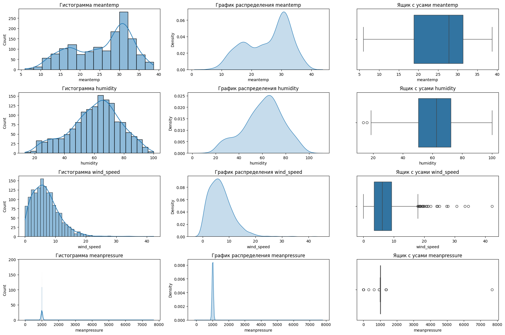
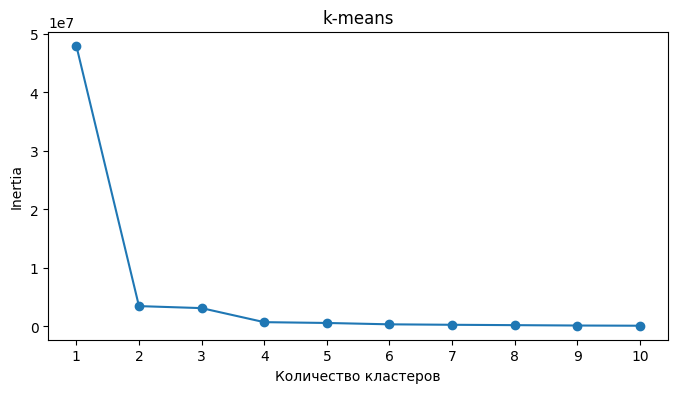
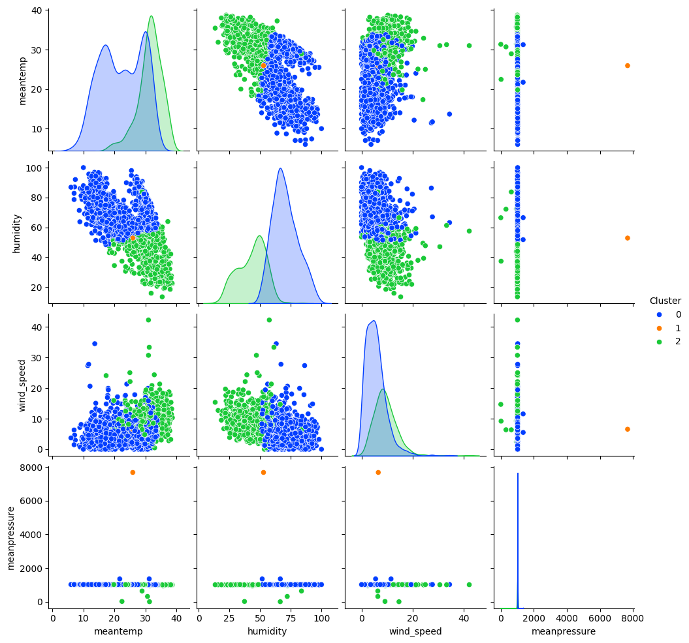

## Практическое задание № 8. Задача прогнозирования временных рядов

Ф.И.О Студента: **Мерич Дорук Каймакджыоглу**

Студ №: **1032204917**

1. Загрузить набор данных прогнозирования погодных условий [набор данных (DailyDelhiClimateTest | DailyDelhiClimateTrain)](https://www.kaggle.com/datasets/sumanthvrao/daily-climate-time-series-data?datasetId=312121&sortBy=voteCount) как датафрейм библиотеки pandas
2. Получить представлении о наборе данных с помощью методов shape, head, describe, info библиотеки pandas. Посчитать количество пустых значений в признаках с помощью библиотеки numpy
3. Произвести разведочный анализ данных по данному набору данных – визуализировать данные с помощью библиотек matplotlib, seaborn, plotly.
Построить:
    1) Гистограммы распределения данных
    2) Графики распределения данных
    3) Ящики с усами (диаграммы размаха)
4. На основе выполненного анализа данных произвести выводы об особенностях набора данных
5. Провести кластеризацию данных
6. Произвести обучение следующих моделей библиотеки sklearn:
    1) XGBoost Regressor
7. Отобразить точность работы модели на тестовой и обучающей выборках с помощью метрики r squared (р-квадрат, коэффициент детерминации) библиотеки sklearn.


```python
import pandas as pd
import numpy as np

train_df = pd.read_csv('datasets_ml/DailyDelhiClimateTrain.csv')
test_df = pd.read_csv('datasets_ml/DailyDelhiClimateTest.csv')

print("---- Train Data ----")
print("Shape of the dataset:", train_df.shape)
print("\nFirst 5 rows:\n", train_df.head())
print("\nData Description:\n", train_df.describe())
print("\nData Information:")
train_df.info()
```

    ---- Train Data ----
    Shape of the dataset: (1462, 5)
    
    First 5 rows:
              date   meantemp   humidity  wind_speed  meanpressure
    0  2013-01-01  10.000000  84.500000    0.000000   1015.666667
    1  2013-01-02   7.400000  92.000000    2.980000   1017.800000
    2  2013-01-03   7.166667  87.000000    4.633333   1018.666667
    3  2013-01-04   8.666667  71.333333    1.233333   1017.166667
    4  2013-01-05   6.000000  86.833333    3.700000   1016.500000
    
    Data Description:
               meantemp     humidity   wind_speed  meanpressure
    count  1462.000000  1462.000000  1462.000000   1462.000000
    mean     25.495521    60.771702     6.802209   1011.104548
    std       7.348103    16.769652     4.561602    180.231668
    min       6.000000    13.428571     0.000000     -3.041667
    25%      18.857143    50.375000     3.475000   1001.580357
    50%      27.714286    62.625000     6.221667   1008.563492
    75%      31.305804    72.218750     9.238235   1014.944901
    max      38.714286   100.000000    42.220000   7679.333333
    
    Data Information:
    <class 'pandas.core.frame.DataFrame'>
    RangeIndex: 1462 entries, 0 to 1461
    Data columns (total 5 columns):
     #   Column        Non-Null Count  Dtype  
    ---  ------        --------------  -----  
     0   date          1462 non-null   object 
     1   meantemp      1462 non-null   float64
     2   humidity      1462 non-null   float64
     3   wind_speed    1462 non-null   float64
     4   meanpressure  1462 non-null   float64
    dtypes: float64(4), object(1)
    memory usage: 57.2+ KB
    


```python
print("---- Test Data ----")
print("Shape of the dataset:", test_df.shape)
print("\nFirst 5 rows:\n", test_df.head())
print("\nData Description:\n", test_df.describe())
print("\nData Information:")
test_df.info()
```

    ---- Test Data ----
    Shape of the dataset: (114, 5)
    
    First 5 rows:
              date   meantemp   humidity  wind_speed  meanpressure
    0  2017-01-01  15.913043  85.869565    2.743478     59.000000
    1  2017-01-02  18.500000  77.222222    2.894444   1018.277778
    2  2017-01-03  17.111111  81.888889    4.016667   1018.333333
    3  2017-01-04  18.700000  70.050000    4.545000   1015.700000
    4  2017-01-05  18.388889  74.944444    3.300000   1014.333333
    
    Data Description:
              meantemp    humidity  wind_speed  meanpressure
    count  114.000000  114.000000  114.000000    114.000000
    mean    21.713079   56.258362    8.143924   1004.035090
    std      6.360072   19.068083    3.588049     89.474692
    min     11.000000   17.750000    1.387500     59.000000
    25%     16.437198   39.625000    5.563542   1007.437500
    50%     19.875000   57.750000    8.069444   1012.739316
    75%     27.705357   71.902778   10.068750   1016.739583
    max     34.500000   95.833333   19.314286   1022.809524
    
    Data Information:
    <class 'pandas.core.frame.DataFrame'>
    RangeIndex: 114 entries, 0 to 113
    Data columns (total 5 columns):
     #   Column        Non-Null Count  Dtype  
    ---  ------        --------------  -----  
     0   date          114 non-null    object 
     1   meantemp      114 non-null    float64
     2   humidity      114 non-null    float64
     3   wind_speed    114 non-null    float64
     4   meanpressure  114 non-null    float64
    dtypes: float64(4), object(1)
    memory usage: 4.6+ KB
    


```python
train_df.isnull().sum()
```


    date            0
    meantemp        0
    humidity        0
    wind_speed      0
    meanpressure    0
    dtype: int64


```python
test_df.isnull().sum()
```


    date            0
    meantemp        0
    humidity        0
    wind_speed      0
    meanpressure    0
    dtype: int64


```python
import matplotlib.pyplot as plt
import seaborn as sns

features = ['meantemp', 'humidity', 'wind_speed', 'meanpressure']
fig, axes = plt.subplots(len(features), 3, figsize=(18, 12))

for i, feature in enumerate(features):
    sns.histplot(train_df[feature], ax=axes[i, 0], kde=True)
    axes[i, 0].set_title(f'Гистограмма {feature}')
    
    sns.kdeplot(train_df[feature], ax=axes[i, 1], fill=True)
    axes[i, 1].set_title(f'График распределения {feature}')
    
    sns.boxplot(x=train_df[feature], ax=axes[i, 2])
    axes[i, 2].set_title(f'Ящик с усами {feature}')

plt.tight_layout()
plt.show()
```


    

    


```python
from sklearn.cluster import KMeans

inertia = []

k_range = range(1, 11)
for k in k_range:
    kmeans = KMeans(n_clusters=k, random_state=1).fit(train_df.iloc[:, 1:])
    inertia.append(kmeans.inertia_)

plt.figure(figsize=(8, 4))
plt.plot(k_range, inertia, marker='o')
plt.title("k-means")
plt.xlabel("Количество кластеров")
plt.ylabel("Inertia")
plt.xticks(k_range)
plt.show()
```


    

    


```python
optimal_k = 3
kmeans = KMeans(n_clusters=optimal_k, random_state=1).fit(train_df.iloc[:, 1:])
clusters = kmeans.labels_

train_df_with_clusters = train_df.copy()
train_df_with_clusters['Cluster'] = clusters
sns.pairplot(train_df_with_clusters, hue='Cluster', palette='bright')
plt.show()
```


    

    


```python

```
